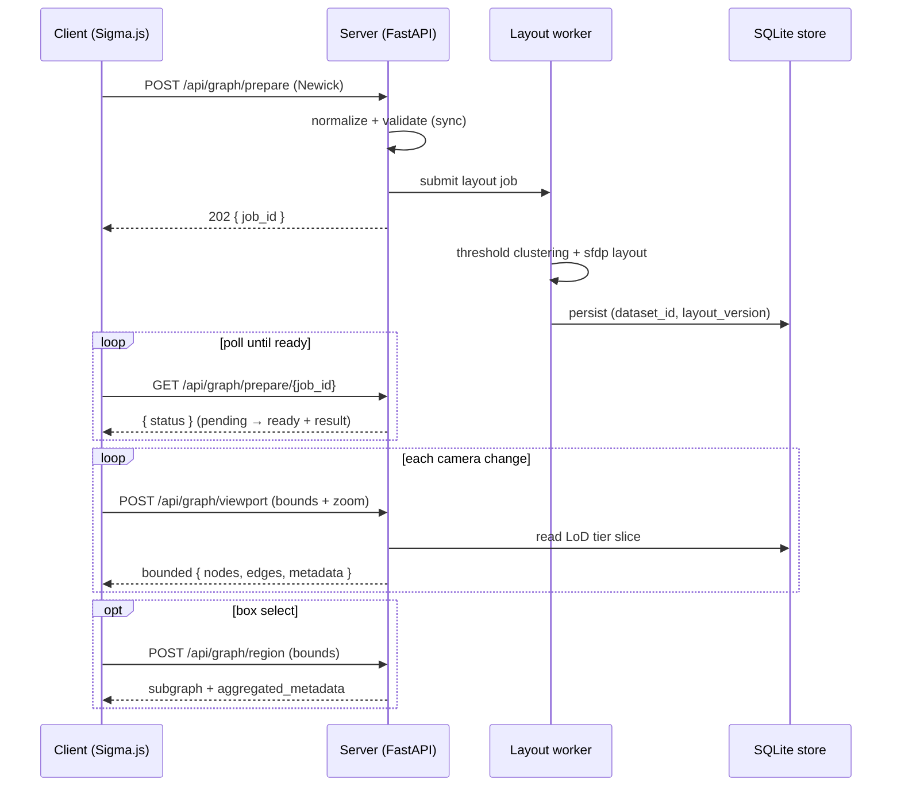

# PhyloLens

PhyloLens is a scalable phylogenetic visualization system that re-imagines the
PHYLOViZ desktop experience as a **server-precomputed, semantic-zoom** web tool.
A dataset is prepared once — parsed, normalized, clustered into a distance
threshold hierarchy, and laid out — then the client renders only the slice of
the graph visible in the current camera viewport at the current zoom tier. The
browser never holds the full topology of a large tree.

The runtime contract is `O(visible slice)`: precomputation absorbs the expensive
global work, and every interaction is a cheap bounded read.

## Repository Layout

| Path | What it is |
| --- | --- |
| [`code/server`](code/server/README.md) | **PhyloLens API service** — FastAPI service for normalization, threshold clustering, `sfdp` layout precompute, and bounded viewport/region reads, backed by a SQLite prepared-layout store. Distributed as a Docker runtime. |
| [`code/client`](code/client/README.md) | **Browser library** — TypeScript/Sigma.js renderer with server-driven level-of-detail, metadata-driven coloring/sizing, and box-select region isolation. Packaged as `@phyloviz/phylo-lens`. |
| [`docs`](docs/README.md) | Maintained technical documentation (architecture, data model, pipeline, LoD, rendering, API reference). |
| [`examples`](examples/README.md) | Small input datasets for local runs and tests. |

## How It Works



1. **`POST /api/graph/prepare`** normalizes and validates the dataset
   synchronously, then submits a background layout job (returns `202`).
2. The server builds a deterministic distance-threshold hierarchy (Union-Find
   over weighted edges, up to 16 tiers) and computes force-directed positions
   (Graphviz `sfdp`), persisting the result to SQLite keyed by
   `(dataset_id, layout_version)`.
3. The client **polls `GET /api/graph/prepare/{job_id}`** until the layout is
   `ready`, then maps camera zoom to a LoD tier and calls
   **`POST /api/graph/viewport`** for each camera change to pull a bounded slice.
4. **`POST /api/graph/region`** serves an on-demand box-select read with
   aggregated metadata for a hand-drawn selection.

See [`docs/ARCHITECTURE_SPEC.md`](docs/ARCHITECTURE_SPEC.md) for the system map
and [`docs/API_REFERENCE.md`](docs/API_REFERENCE.md) for the field-level API
reference with runnable examples.

## Quick Start

**Backend** (see [`code/server/README.md`](code/server/README.md)):

```bash
cd code/server
pip install -e '.[test,dev]'
uvicorn phylo_lens_server.main:app --reload   # serves http://localhost:8000
```

Or run the containerized PhyloLens API service:

```bash
cd code/server
docker build -t ghcr.io/phyloviz/phylo-lens-service:0.1.0 .
docker run --rm -p 8000:8000 -v phylo-lens-data:/data ghcr.io/phyloviz/phylo-lens-service:0.1.0
```

**Frontend** (see [`code/client/README.md`](code/client/README.md)):

```bash
cd code/client
npm ci
npm run dev                                    # serves http://localhost:3000
```

Host applications install `@phyloviz/phylo-lens` and pass the deployed service
URI as `apiUrl`:

```ts
createPhyloLensView({ container, apiUrl: "http://localhost:8000" });
```

**Validation:**

```bash
cd code/server && pytest -q
cd ../client   && npm run build && npm test
```

## Documentation

Start at [`docs/README.md`](docs/README.md) for the full reading guide. Key entry
points:

- [Architecture](docs/ARCHITECTURE_SPEC.md) — the whole system at a glance
- [API Reference](docs/API_REFERENCE.md) — HTTP routes, models, errors, examples
- [Server pipeline](docs/SERVER_PIPELINE.md) — how a dataset becomes a layout
- [LoD and clustering](docs/LOD_AND_CLUSTERING.md) — how zoom maps to detail
- [Client rendering](docs/CLIENT_RENDERING.md) — rendering, coloring, and
  consuming the client as a library
- [Backend README](code/server/README.md) · [Frontend README](code/client/README.md)
  · [Examples](examples/README.md)
