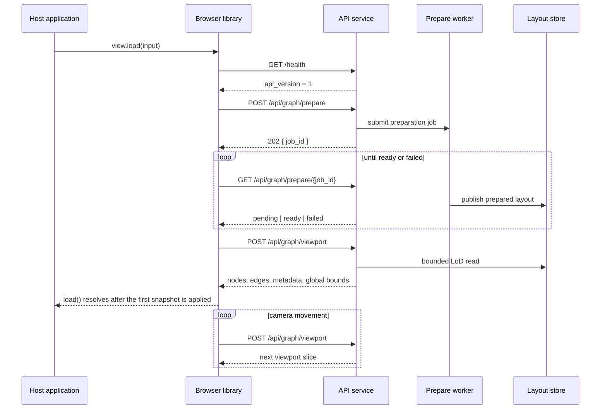

# PhyloLens

PhyloLens is an embeddable browser visualization library and companion API
service for interactive exploration of large phylogenetic trees and
typing-derived graphs.

The browser package owns rendering and interaction. The service owns input
normalization, PhyloLib-based typing-data processing, Graphviz layout
computation, level-of-detail (LoD) materialization, persistence, and bounded
viewport queries. Host applications integrate the library through one public
entry point and deploy the service independently.

```text
host application
    │
    ├── @phyloviz/phylo-lens
    │      rendering, camera state, semantic zoom, local metadata filters
    │
    └── PhyloLens API service
           normalization, PhyloLib, layout, LoD, persistence, viewport reads
```

PhyloLens is designed to avoid transferring and rendering the complete prepared
graph for every interaction. The client requests the graph subset required for
the current viewport and semantic-zoom tier. The limits of that design are
measured in the thesis evaluation; the documentation does not make unsupported
performance claims.

## Distribution units

| Artefact | Identifier | Responsibility |
| --- | --- | --- |
| Browser library | `@phyloviz/phylo-lens` | Public TypeScript API, Sigma renderer, interaction and viewport synchronization |
| API service | `ghcr.io/phyloviz/phylo-lens-service` | Normalization, layout preparation, LoD construction, persistence and graph queries |
| HTTP contract | API version `1` | Compatibility boundary between the browser library and the service |

The npm package version, Python service version, and Docker image tag use the
same release version. The API contract version is independent and changes only
when the HTTP contract becomes incompatible.

## Supported input

PhyloLens currently accepts:

- **Newick trees or forests**, including branch lengths, quoted labels,
  comments, labeled internal nodes, and multiple `;`-terminated components;
- **MLST/cgMLST allelic-profile matrices**, processed with PhyloLib using
  Hamming distance and goeBURST;
- **CSV or TSV ancillary metadata**, joined to explicitly labeled nodes or
  typing-profile identifiers.

See [Input formats](docs/INPUT_FORMATS.md) for the exact contracts and
normalization rules.

## Runtime lifecycle



## Quick start

### 1. Run the API service

```bash
docker run --rm \
  -p 8000:8000 \
  -e PHYLO_LENS_CORS_ORIGINS=http://localhost:5173 \
  -v phylo-lens-data:/data \
  ghcr.io/phyloviz/phylo-lens-service:0.2.0
```

Verify the service:

```bash
curl http://localhost:8000/health
```

```json
{
  "status": "ok",
  "service_version": "0.2.0",
  "api_version": "1"
}
```

### 2. Install the browser library

```bash
npm install @phyloviz/phylo-lens
```

```ts
import { createPhyloLensView } from "@phyloviz/phylo-lens";

const container = document.getElementById("graph-root");
if (!(container instanceof HTMLElement)) {
  throw new Error("Missing graph container.");
}

const view = createPhyloLensView({
  container,
  apiUrl: "http://localhost:8000",
});

await view.load({
  content: "(A:1,(B:2,C:4)N:3)R;",
  name: "example-tree",
  sourceFormat: "newick",
});

// Release renderer resources when the host removes the view.
view.dispose();
```

`load()` resolves after preparation completes, the first viewport response is
received, and the first graph snapshot is applied to the renderer. It rejects
when the service is unavailable, the API contract is incompatible, preparation
fails, or the initial viewport cannot be loaded.

For production, a same-origin reverse proxy is usually simpler than direct
cross-origin access. See [Server deployment](code/server/README.md#browser-integration).

## Repository layout

| Path | Contents |
| --- | --- |
| [`code/client`](code/client/README.md) | Browser package and reference demo |
| [`code/server`](code/server/README.md) | FastAPI service, workers, persistence and Docker image |
| [`docs`](docs/README.md) | Architecture, contracts, pipeline and operational documentation |
| [`examples`](examples/README.md) | Input fixtures and external package-consumer fixture |
| [`scripts`](scripts) | Release-version and packed-package validation scripts |

## Development validation

```bash
cd code/server
python -m pip install -e '.[test,dev]'
ruff check src tests
ruff format --check src tests
pytest -q

cd ../client
npm ci
npm run format:check
npm run lint
npm test
npm run build
npm run build:lib
```

The GitHub Actions workflow additionally builds the packed npm tarball in an
external host fixture and smoke-tests the Docker service on `linux/amd64` and
`linux/arm64`.

## Documentation

Start with the [documentation index](docs/README.md).

- [Architecture](docs/ARCHITECTURE_SPEC.md)
- [Runtime flow](docs/flow.md)
- [Input formats](docs/INPUT_FORMATS.md)
- [HTTP API reference](docs/API_REFERENCE.md)
- [Data model and persistence](docs/DATA_MODEL.md)
- [Server preparation pipeline](docs/SERVER_PIPELINE.md)
- [LoD and clustering](docs/LOD_AND_CLUSTERING.md)
- [Client rendering](docs/CLIENT_RENDERING.md)
- [Cluster interaction](docs/EXPAND_COLLAPSE.md)
- [CI and release process](docs/RELEASE.md)
- [Known limitations and future work](docs/BACKLOG.md)
