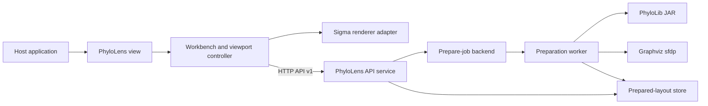
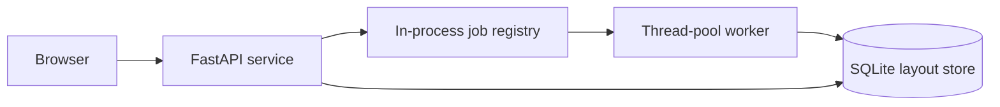
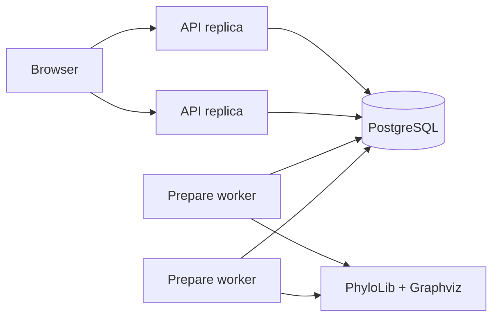

# Architecture

PhyloLens is a two-part system:

1. an embeddable browser library for interaction and rendering;
2. an API service for computational preparation and graph queries.

The boundary is intentional. Global topology, layout, LoD construction, and
persistence remain server-side. Camera state, semantic-zoom selection, visual
mapping, and rendering remain browser-side.



## Architectural objectives

### Keep the host integration small

The public package surface is centered on:

```ts
const view = createPhyloLensView({ container, apiUrl });
await view.load(input);
view.dispose();
```

Host applications do not construct transport clients, polling loops, renderer
factories, or layout-version state.

### Move global computation out of the browser

The service performs operations that require the complete graph:

- normalization and validation;
- typing-profile conversion;
- global layout;
- cluster hierarchy construction;
- per-tier quotient-edge construction;
- persistent metadata aggregation.

The browser receives prepared graph slices rather than deriving topology from
partial data.

### Precompute once, query repeatedly

Preparation materializes a content-derived layout version. Interactive requests
reuse persisted positions, clusters, edges, and metadata. This avoids rerunning
global layout on camera movement.

### Bound interactive payloads

Viewport and region queries accept node budgets and return truncation metadata.
The service may add neighbour nodes required to preserve visible edge endpoints,
and explicit cluster expansion may return an entire cluster.

### Preserve renderer isolation

Sigma and Graphology are hidden behind the internal renderer adapter. The HTTP
contract and public package API do not expose Sigma classes or Graphology data
structures.

## Component responsibilities

### Browser library

| Component | Responsibility |
| --- | --- |
| `phyloLensView.ts` | Public lifecycle facade and disposed/superseded load semantics |
| `api/` | HTTP transport, runtime response guards, service compatibility check |
| `app/workbench/` | Dataset preparation workflow, filters, navigation and controller ownership |
| `app/workbench/viewport/` | Camera-to-query mapping, viewport refresh, cluster expansion/collapse |
| `render/` | Renderer-neutral graph contracts and visual mappings |
| `render/adapters/sigma/` | Sigma instance, Graphology graph and browser event integration |
| `ancillary/` | Metadata indexes and client-side filters |

Dependency direction:

```text
public view
  → workbench
    → graph client
    → viewport controller
    → renderer interface
      → Sigma adapter
```

The renderer adapter does not own service requests. The viewport controller does
not expose Sigma-specific objects to the workbench.

### API service

| Layer | Responsibility |
| --- | --- |
| `http/` | FastAPI routes, request/response schemas and HTTP error mapping |
| `services/` | Application use cases: prepare, status, viewport, region and search |
| `data/` | Newick parsing, ancillary normalization and PhyloLib integration |
| `domain/` | Canonical models, metadata rules and validation invariants |
| `pipeline/` | clustering, layout, prepared edges and worker orchestration |
| `repository/jobs/` | local or PostgreSQL job control |
| `repository/layout/` | SQLite or PostgreSQL artifact persistence and query readers |
| `config/` | deployment configuration and timeout parsing |

Dependency direction:

```text
HTTP
  → services
    → data/domain
    → job repositories
    → layout repositories
      → database

prepare worker
  → pipeline
    → layout repository
    → PhyloLib / Graphviz
```

Domain models do not depend on HTTP, database, Graphviz, or browser code.

## Deployment modes

### Local/single-service mode



Characteristics:

- one service process owns job state;
- preparation runs in an in-process worker;
- prepared layouts persist in SQLite;
- local capacity is reserved before normalization, including typing-data work;
- suitable for development, evaluation, and single-instance deployment.

### Distributed PostgreSQL mode



Characteristics:

- API replicas submit and poll durable jobs;
- workers claim jobs with `FOR UPDATE SKIP LOCKED`;
- leases and heartbeats fence publication;
- prepared artifacts and job state share one database;
- schema initialization is explicit and checksum-verified.

## Runtime boundaries

### Public browser boundary

Only package-root exports are supported. Internal paths are not compatibility
contracts.

### HTTP boundary

The browser and service communicate through API contract version `1`. npm and
service implementation versions may differ as long as they implement the same
contract.

### Preparation boundary

A `CanonicalDataset` is the last input-oriented representation. The preparation
worker turns it into persisted layout artifacts. Interactive reads never accept
raw Newick or typing profiles.

### Renderer boundary

Viewport responses are converted to renderer-neutral positioned graphs before
the Sigma adapter applies them to Graphology.

## Dataset and layout identity

`dataset_id` is caller supplied. `layout_version` is a deterministic fingerprint
of the persisted preparation input:

- explicit pipeline version;
- canonical nodes and edges;
- edge distances;
- metadata schema and values;
- ancillary rows;
- source format and provenance.

Dictionary key order and input object insertion order do not change the
fingerprint. Metadata changes invalidate reuse. The generated timestamp is not
part of the fingerprint.

The pair `(dataset_id, layout_version)` identifies one immutable prepared
layout. Reads that omit `layout_version` resolve the latest published `ready` or
`degraded` version.

## Preparation publication model

A worker writes a version with status `refining`, persists all artifact tables,
and then publishes it as `ready` or `degraded`. Readers do not select refining
versions as the latest layout.

This prevents an incomplete preparation from replacing a previously published
version.

## Core correctness invariants

- Every canonical edge references existing nodes.
- Every edge entering layout preparation carries a finite, non-negative
  distance.
- A layout version changes when any persisted input changes.
- Every returned viewport edge references returned nodes.
- Cluster expansion preserves external connectivity through server-computed
  meta-edges.
- Published metadata schemas, search results, and region summaries exclude
  internal aggregation keys; viewport render metadata may retain them for pie
  and profile-count mappings.
- Local completed jobs do not retain complete prepared graphs after result
  payload extraction.
- Only the most recent browser `load()` may commit renderer state.
- `load()` resolves after the first viewport snapshot is applied.

## Performance model

The architecture separates two cost classes.

### Preparation cost

Preparation has access to the complete graph and includes:

- parsing and normalization;
- optional PhyloLib subprocesses;
- threshold selection and component construction;
- Graphviz global layout;
- per-tier edge construction;
- metadata aggregation;
- persistence.

### Interaction cost

Interactive operations read persisted data:

- viewport query by bounds and LoD tier;
- cluster expansion by cluster ID;
- region query by bounds;
- node/metadata search.

Database indexes and response budgets are intended to make interaction cost track
the selected slice rather than require global recomputation. The thesis
evaluation must quantify the actual latency, memory, and scaling behavior.

## Related documents

- [Runtime flow](flow.md)
- [Input formats](INPUT_FORMATS.md)
- [API reference](API_REFERENCE.md)
- [Data model](DATA_MODEL.md)
- [Server preparation pipeline](SERVER_PIPELINE.md)
- [LoD and clustering](LOD_AND_CLUSTERING.md)
- [Client rendering](CLIENT_RENDERING.md)
