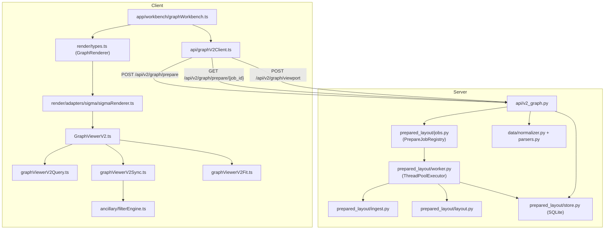

# Architecture

PhyloLens is split into a server-side **data engine** and a Sigma.js **client**.
The server owns phylogenetic semantics: parsing, normalization, threshold
clustering, force-directed layout, level-of-detail (LoD) precomputation, and
bounded viewport reads. The client owns interaction: camera state, semantic-zoom
tier selection, rendering, colors, and local metadata filtering.

This document is the system-level map. For the runtime narrative see
[`flow.md`](./flow.md); for contracts and storage see
[`DATA_MODEL.md`](./DATA_MODEL.md); for the prepare pipeline see
[`SERVER_PIPELINE.md`](./SERVER_PIPELINE.md); for the zoom engine see
[`LOD_AND_CLUSTERING.md`](./LOD_AND_CLUSTERING.md); for rendering see
[`CLIENT_RENDERING.md`](./CLIENT_RENDERING.md).

## Design Principles

1. **Semantics stay server-side.** Parsing, validation, weighted clustering,
   layout, and slice selection are server concerns. The client never re-derives
   topology.
2. **Precompute before interaction.** All expensive global work happens once in
   `prepare`. Interactive camera updates issue bounded, indexed viewport reads.
3. **Materialize, don't recompute.** Prepared artifacts (clusters, per-tier
   edges, node positions, metadata) are persisted in SQLite keyed by
   `(dataset_id, layout_version)` and read back by query, not rebuilt.
4. **Keep runtime payloads bounded.** A viewport read returns at most
   `max_nodes` nodes; the response carries a `truncated` flag and the true
   `total_node_count` so the client knows it is seeing a slice.
5. **Rendering is adapter-based.** Sigma-specific behavior lives behind the
   `GraphRenderer` interface and must not leak into API contracts or clustering.

## Two-Endpoint Contract

The entire v2 runtime is driven by two FastAPI routes under the prefix
`/api/v2/graph` (`api/v2_graph.py`, `ROUTER_PREFIX`):

- **`POST /api/v2/graph/prepare`** — `prepare_graph_v2()`. Takes a
  `NormalizeRequest`, normalizes it into a `CanonicalDataset` (synchronously, so
  bad input fails with a `4xx`), then submits the force-directed layout to a
  background worker and returns `202 Accepted` with a `GraphV2PrepareJob`
  (`job_id`, `status: "pending"`, `dataset_id`).
- **`GET /api/v2/graph/prepare/{job_id}`** — `prepare_graph_v2_status()`. Polls
  a prepare job, returning `GraphV2PrepareStatus` (`status` of
  `pending`/`ready`/`failed`; the full `GraphV2PrepareResponse` under `result`
  once ready — `dataset_id`, `layout_version`, counts, `lod_tier_count`,
  `layout_status`, `warnings`; or `error` when failed). Unknown `job_id` → `404`.
- **`POST /api/v2/graph/viewport`** — `read_graph_viewport()`. Takes a
  `GraphViewportQuery` (bounds, `zoom`, `lod_level`, `cluster_id`, `max_nodes`)
  and returns a `GraphViewportResponse` (visible `nodes`, `edges`,
  `total_node_count`, `truncated`, `metadata_schema`).

There is no separate `normalize` route in the runtime path: normalization is a
step inside `prepare`. Defaults: `DEFAULT_MAX_VIEWPORT_NODES = 2500`,
`HARD_MAX_VIEWPORT_NODES = 20000`.

## Server Modules

### `core`

Pydantic contracts and domain errors: `CanonicalDataset`, `CanonicalNode`,
`CanonicalEdge`, metadata field types, and the internal-key filter in
`core/metadata_keys.py` (`is_internal_metadata_key`). `core` must not import
parsing, HTTP, or layout code.

### `data`

Parsing and normalization. `parse_newick` reads Newick trees with branch
lengths and assigns deterministic node IDs; `normalize_dataset` produces the
`CanonicalDataset`, aligns per-node metadata, and can expose the internal
metadata schema for prepare.

### `prepared_layout`

The heart of the server. It turns a `CanonicalDataset` into a persisted,
queryable layout:

- `ingest.py`: threshold selection and Union-Find clustering
  (`prepare_layout_artifacts`, `selected_distance_thresholds`,
  `distance_clusters`, `partition_for_threshold`, `MAX_CLUSTER_THRESHOLDS = 16`).
- `layout.py`: force-directed layout via Graphviz `sfdp`
  (`compute_prepared_layouts`, `graphviz_sfdp_positions`, `sfdp_maxiter`,
  degrade reasons). No subprocess timeout — layout runs to completion on the
  background worker.
- `models.py`: the Pydantic records (`PreparedCluster`, `PreparedEdge`,
  `ClusterLayout`, `NodeLayoutPosition`, `ViewportNode`, `ViewportEdge`,
  `ViewportReadResult`).
- `worker.py`: `PreparedLayoutWorker.prepare_dataset` orchestrates ingest →
  layout → prepared edges → persist; `submit_prepare_dataset` runs it on a
  single-worker `ThreadPoolExecutor`, and `compute_prepared_edges` builds the
  per-tier quotient edge lists.
- `jobs.py`: `PrepareJobRegistry` tracks background prepare `Future`s (plus their
  submit-time warnings) so `/prepare` can submit and clients can poll;
  `PrepareJobSnapshot` is the immutable `pending`/`ready`/`failed` view.
- `store.py`: `PreparedLayoutStore`, the SQLite-backed materialized store, and
  `read_viewport` with its four read paths (see below).

### `api`

`api/v2_graph.py` hosts the three routes above plus request/response models
(`GraphV2PrepareJob`, `GraphV2PrepareStatus`, `GraphV2PrepareResponse`) and
helpers (`ensure_graph_v2_edge_distances`, `effective_lod_level`,
`prepare_response_from_result`, and the `get_prepare_job_registry` singleton).

## Client Modules

### `api`

`graphV2Client.ts` — the typed `GraphV2Client` (`prepareGraph`, `readViewport`),
request/response interfaces, and runtime guards (`isGraphV2PrepareResponse`,
`isGraphV2PrepareJob`, `isGraphV2PrepareStatus`, `isGraphV2ViewportResponse`).
`prepareGraph` encapsulates the async transport: it submits via
`ROUTE_GRAPH_V2_PREPARE`, then polls `GET /prepare/{job_id}` until `ready`
(returning the `GraphV2PrepareResponse`) or `failed` (throwing), so callers see a
single promise. Polling cadence is governed by `DEFAULT_PREPARE_POLL_INTERVAL_MS`
and `DEFAULT_PREPARE_POLL_TIMEOUT_MS`; `httpClient.ts` gained a `get` method for
the status poll.

### `app`

`workbench/graphWorkbench.ts` is the workflow facade. `renderNewick` calls
`prepareGraph`, stores the prepared session (`datasetId`, `layoutVersion`,
`lod_tier_count`, metadata schema), and starts viewport sync through the
renderer. It also owns display options, metadata filters, visual mapping, node
search/focus, and the LoD-refresh pause/resume control.

### `render`

Renderer adapter layer, behind the `GraphRenderer` interface (`render/types.ts`).
The production adapter is Sigma (`render/adapters/sigma/`):

- `sigmaRenderer.ts`: adapter lifecycle, Sigma instance ownership,
  `startGraphV2ViewportSync` / `stopGraphV2ViewportSync` /
  `refreshGraphV2ViewportSync`, and piechart-program rebuilds.
- `GraphViewerV2.ts`: the viewport-sync engine — camera binding, LoD tier
  detection, debounced refresh, cluster expand/collapse, initial fit.
- `graphViewerV2Query.ts`: viewport query building and the semantic-zoom band
  mapping (`semanticLodLevelForCameraRatio`,
  `semanticLodLevelForCameraRatioWithHysteresis`).
- `graphViewerV2Sync.ts`: `syncGraphologyViewport` / `reconcileGraphologyViewport`,
  node/edge attribute derivation, the triangle rule, and PHYLOViZ role coloring
  (`deriveViewportNodeColor`).
- `graphViewerV2Fit.ts`: camera fit animations.
- `sigmaAttributeUtils.ts`: attribute lookup and role normalization
  (`firstAttributeValue`, `isTruthyAttribute`, `normalizeRoleValue`).
- `sigmaRenderingConstants.ts`: color and node-type constants.

### `ancillary`

Client-side metadata indexing and filtering (`filterEngine.ts`,
`matchesFilterState`). Local-first; a server-side ancillary path is deferred
until benchmarks justify it (see [`BACKLOG.md`](./BACKLOG.md)).

## Component Map



Renderer adapters must not import app modules; the workbench talks to the
renderer only through the `GraphRenderer` interface. `core` must not import
parsing, HTTP, or layout code.

## Runtime Flow

```mermaid
sequenceDiagram
  participant WB as GraphWorkbench
  participant API as GraphV2Client
  participant Srv as Server (v2_graph)
  participant Store as SQLite Store
  participant GV as GraphViewerV2

  WB->>API: prepareGraph(NormalizeRequest)
  API->>Srv: POST /api/v2/graph/prepare
  Srv->>Srv: normalize (sync); submit layout to background worker
  Srv-->>API: 202 { job_id, status: "pending" }
  loop poll until resolved
    API->>Srv: GET /api/v2/graph/prepare/{job_id}
    Srv->>Srv: ingest -> sfdp -> prepared edges (on worker)
    Srv->>Store: persist artifacts (dataset_id, layout_version)
    Srv-->>API: { status: ready, result: GraphV2PrepareResponse }
  end
  API-->>WB: prepared session (lod_tier_count, layout_status)

  WB->>GV: startGraphV2ViewportSync(lodTierCount)
  GV->>API: readViewport(lod_level=0, forceGlobal)
  API->>Srv: POST /api/v2/graph/viewport
  Srv->>Store: read_viewport(...)
  Store-->>Srv: ViewportReadResult
  Srv-->>API: GraphViewportResponse (nodes, edges, truncated)
  API-->>GV: viewport slice
  GV->>GV: sync + reconcile Graphology, fit camera

  loop camera pan / zoom
    GV->>GV: semanticLodLevelForCameraRatioWithHysteresis
    GV->>API: debounced readViewport(lod_level, bounds)
    API->>Srv: POST /api/v2/graph/viewport
    Srv->>Store: read_viewport(...)
    Srv-->>GV: next slice
  end
```

## Core Contracts

Full field lists live in [`DATA_MODEL.md`](./DATA_MODEL.md); summarized here.

### `CanonicalDataset`

The normalized, correctness-first representation produced by
`normalize_dataset`: `dataset_id`, `nodes`, `edges` (with `distance`),
`metadata_schema`, `metadata_by_node_id`, and `source`. It is the input to
prepare, not the browser payload.

### `GraphViewportQuery` (client → server)

`dataset_id`, optional `layout_version`, optional `cluster_id` (cluster
expansion), optional bounds (`xmin/xmax/ymin/ymax`), `zoom`, optional
`lod_level` (0-based tier index), `max_nodes` (1–20000). Bounds are validated as
all-present-or-all-absent.

### `GraphViewportResponse` (server → client)

`dataset_id`, `layout_version`, echoed `lod_level`, `zoom`, `layout_status`,
`truncated`, `total_node_count`, `nodes` (`GraphViewportNode`), `edges`
(`GraphViewportEdge`), `metadata_schema`. A cluster representative carries
`is_representative = true` and `member_count > 1`. Rerouted boundary edges carry
`is_meta = true` and `bundled_edge_count`.

## Correctness Invariants

- Same input produces deterministic normalized output and a deterministic
  `layout_version`.
- Same prepared artifacts and query produce deterministic viewport slices
  (Union-Find components are order-independent; ties break deterministically).
- Every returned edge references returned visible nodes — including meta-edges,
  which reroute to the visible representative.
- `total_node_count` is the untruncated count; `truncated` is true exactly when
  more nodes existed than were returned under `max_nodes`.
- Off-camera branches are not expanded except through an explicit `cluster_id`
  expansion request.
- Internal metadata keys (`profile_count`, `__category_count__*`) never appear
  in node, cluster, or schema payloads.
- Cluster metadata aggregation is mode for categorical/boolean, mean for
  numeric.

## Performance Model

**Prepare-time (once):** normalize; select up to 16 distance thresholds; build
Union-Find components per threshold; run `sfdp` global layout; compute cluster
positions/bounds and per-tier quotient edges; persist to SQLite.

**Interaction-time (per viewport):** resolve `lod_level` from zoom/hint; run one
of four `read_viewport` paths (bounds-indexed representative or ready-node read,
overview read, or `cluster_id` expansion); attach metadata; return a
`max_nodes`-bounded slice. Viewport reads use SQLite indexes on cluster bounds
(`idx_prepared_clusters_bounds`) and node positions (`idx_node_positions_xy`),
so cost tracks the returned slice, not total dataset size.

## Future Work

- Cache repeated viewport/zoom queries server-side.
- Tune threshold selection using projected cluster size and label density.
- Pre-cluster before `sfdp` above a node-count threshold (see
  [`BACKLOG.md`](./BACKLOG.md)).
- Add server-side ancillary filtering only if benchmarks show client-side
  filtering or metadata transfer is a bottleneck.
