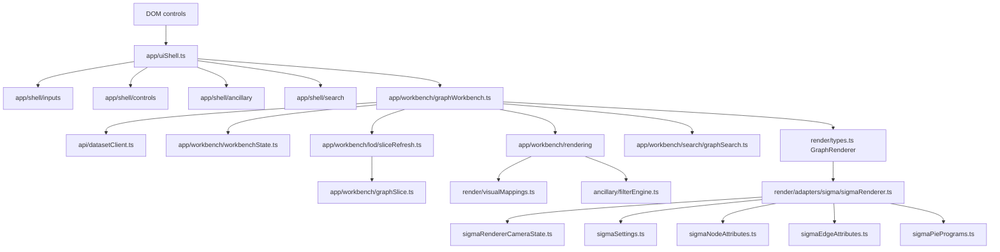
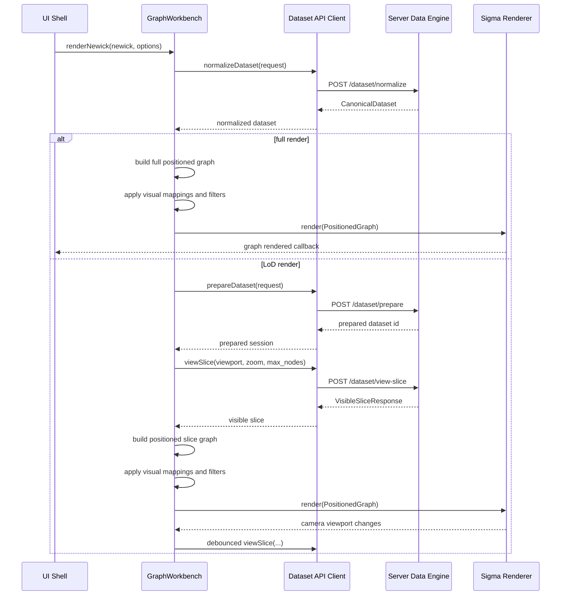

# Architecture

PhyloLens is split into a server-side data engine and a Sigma-based client. The
server owns phylogenetic semantics, normalization, LoD precomputation, spatial
indexes, and visible-slice selection. The client owns interaction, camera state,
rendering, and local visual mappings.

## Design Principles

1. **Semantics stay server-side.** Parsing, validation, weighted topology, LoD
   hierarchy construction, and visible-slice selection are server concerns.
2. **Rendering is adapter-based.** Sigma-specific behavior must not leak into
   canonical contracts or clustering logic.
3. **Precompute before interaction.** Expensive global work happens during
   `prepare`; interactive camera updates issue bounded window queries.
4. **Use stable coordinate space.** The client camera and server selector share
   one global coordinate system through `global_bounds`.
5. **Keep runtime payloads bounded.** The browser receives only visible nodes,
   visible edges, and collapsed-cluster metadata.

## Server Modules

### `core`

Defines Pydantic contracts and domain validation errors:

- canonical nodes, edges, metadata, and datasets;
- threshold hierarchy clusters and indexes;
- spatial bounds and spatial index nodes;
- visible-slice request/response contracts;
- prepared dataset records.

`core` must not import parsing, HTTP, clustering, or rendering code.

### `data`

Parses and normalizes input data:

- Newick input, including optional branch lengths;
- deterministic node/edge ordering;
- metadata schema and per-node metadata alignment;
- file-backed prepared dataset storage.

The output is a `CanonicalDataset`.

### `clustering`

Builds and queries LoD data structures:

- `threshold_hierarchy.py`: weighted threshold hierarchy construction;
- `spatial.py`: shared viewport and bounding-box math;
- `spatial_index.py`: STR-packed static R-tree construction and query;
- `selector.py`: viewport-aware visible-slice selection.

The active hierarchy path is `ThresholdHierarchyIndex`. Legacy depth/tree
hierarchy code has been removed to keep the runtime model explicit.

### `api`

Exposes FastAPI endpoints:

- `POST /dataset/normalize`
- `POST /dataset/prepare`
- `POST /dataset/view-slice`

`prepare` normalizes input and builds LoD artifacts. `view-slice` loads a
prepared dataset and returns a bounded visible graph slice.

## Client Modules

### `api`

Contains runtime guards for server contracts and typed API clients.

### `app`

Application orchestration is intentionally split between the shell and the
workbench.

`uiShell.ts` is the browser UI coordinator. It binds DOM controls, forwards
commands to the workbench, and delegates detailed UI behavior to focused shell
helpers:

- `shell/inputs`: file reading, download helpers, ancillary payload parsing;
- `shell/controls`: display options, LoD controls, visual mapping controls;
- `shell/ancillary`: node selector state and category summaries;
- `shell/search`: search result rendering;
- `shell/status`: render status formatting.

`workbench/graphWorkbench.ts` is the graph workflow facade. It keeps the public
client workflow API stable while delegating implementation details:

- `workbenchTypes.ts`: public and internal workbench contracts;
- `workbenchState.ts`: session state initialization, reset, pending refresh, and
  graph-rendered events;
- `rendering/graphRendering.ts`: visual mapping, metadata filtering, and render
  handoff;
- `rendering/graphFilters.ts`: apply/clear metadata filters and update visual
  mapping;
- `lod/sliceRefresh.ts`: visible-slice request, positioned graph construction,
  view metadata, camera focus hooks;
- `lod/clusterExpansion.ts`: cluster proxy click and expansion state;
- `search/graphSearch.ts`: local full-graph search.

The workbench owns orchestration, not rendering internals. It prepares or
normalizes datasets, chooses full vs LoD mode, schedules refreshes on camera
changes, and calls the renderer adapter through the `GraphRenderer` interface.

### `render`

Renderer adapter layer. The current production adapter is Sigma:

- maps positioned graph nodes/edges into Graphology;
- renders cluster proxies as distinct visual entities;
- preserves camera state across refreshes;
- emits camera viewport updates in the server-provided global coordinate space.

The Sigma adapter is split by rendering concern:

- `sigmaRenderer.ts`: mounted adapter lifecycle, Sigma instance ownership,
  renderer API implementation, event wiring, and rebuild orchestration;
- `sigmaRendererCameraState.ts`: custom bounds, camera state read/restore, and
  center-on-node camera updates;
- `sigmaNodeRendering.ts`: stable barrel for node-rendering helpers;
- `sigmaSettings.ts`: Sigma settings and node program registration;
- `sigmaNodeAttributes.ts`: positioned-node to Graphology-node attributes;
- `sigmaEdgeAttributes.ts`: positioned-edge to Graphology-edge attributes;
- `sigmaPiePrograms.ts`: dynamic piechart node program construction;
- `sigmaLabels.ts`: node and edge label drawing;
- `sigmaRenderingConstants.ts`: rendering constants;
- `sigmaAttributeUtils.ts`: attribute and role normalization helpers.

### `ancillary`

Client-side metadata indexing and filtering. This is still local-first; the
future server-side ancillary path should be added only if metadata transfer or
filtering becomes a benchmarked bottleneck.

## Client Dependency Flow

Imports should follow this direction. Shell helpers must not import the
workbench. Renderer adapters must not import app modules. Shared contracts stay
under `contracts`, `render/types`, or API model modules.

## Runtime Flow

## Core Contracts

### `CanonicalDataset`

The correctness-first normalized representation. It is allowed to materialize
the full topology during prepare, but it is not the intended browser payload for
large datasets.

### `ThresholdHierarchyIndex`

Prepared server-side LoD artifact:

- `root_cluster_id`
- `clusters`
- `global_bounds`
- `max_distance_threshold_level`
- `cluster_ids_by_level`
- `spatial_index_by_level`

It is persisted on the server and should not be shipped wholesale to the client
for large datasets.

### `VisibleSliceQuery`

Runtime client request:

- `dataset_id`
- `viewport`
- `zoom`
- optional `lod_hint`
- optional `max_nodes`
- optional `focus_node_id`

The viewport is expressed in global server/client coordinates.

### `VisibleSliceResponse`

Runtime server response:

- visible `nodes`
- visible `edges`
- `collapsed_clusters`
- `view_meta`, including returned counts and `global_bounds`

Proxy nodes are explicit. A collapsed cluster represented in the slice carries
`is_cluster_proxy`, `cluster_id`, `subtree_size`, and `leaf_count`.

## Correctness Invariants

- Same input and options produce deterministic normalized output.
- Same prepared hierarchy and query produce deterministic visible slices.
- Every visible edge references returned visible nodes.
- `view_meta.returned_node_count` and `returned_edge_count` match payload sizes.
- A slice must not expand off-camera branches unless they are part of an
  explicit focus path.
- `max_nodes` is treated as a hard upper bound for rendered cluster expansion.
- Camera viewport calculations use `global_bounds`, not the bounds of the
  currently rendered slice.

## Performance Model

Prepare-time work:

- parse and normalize input;
- sort weighted edges;
- build threshold component levels with Union-Find;
- compute representative positions and cluster bounds;
- pack per-level STR spatial indexes.

Interaction-time work:

- map camera state to global viewport;
- query spatial indexes up to target LoD;
- expand only candidate/focus clusters;
- return bounded slice payload.

The intended query cost is proportional to spatial index traversal plus returned
slice size, rather than total dataset size.

## Future Work

- Benchmark STR index build/query time against non-indexed selection.
- Tune threshold-level selection using projected cluster size and label density.
- Add server-side cache for repeated viewport/zoom queries.
- Add server-side ancillary filtering only if benchmarks show client-side
  filtering or metadata transfer is a bottleneck.
- Consider lower-level acceleration after Python data structures and algorithms
  are stable and measured.
