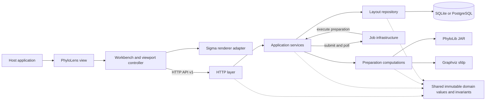
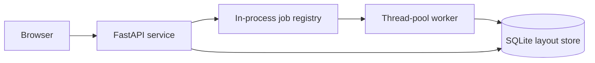
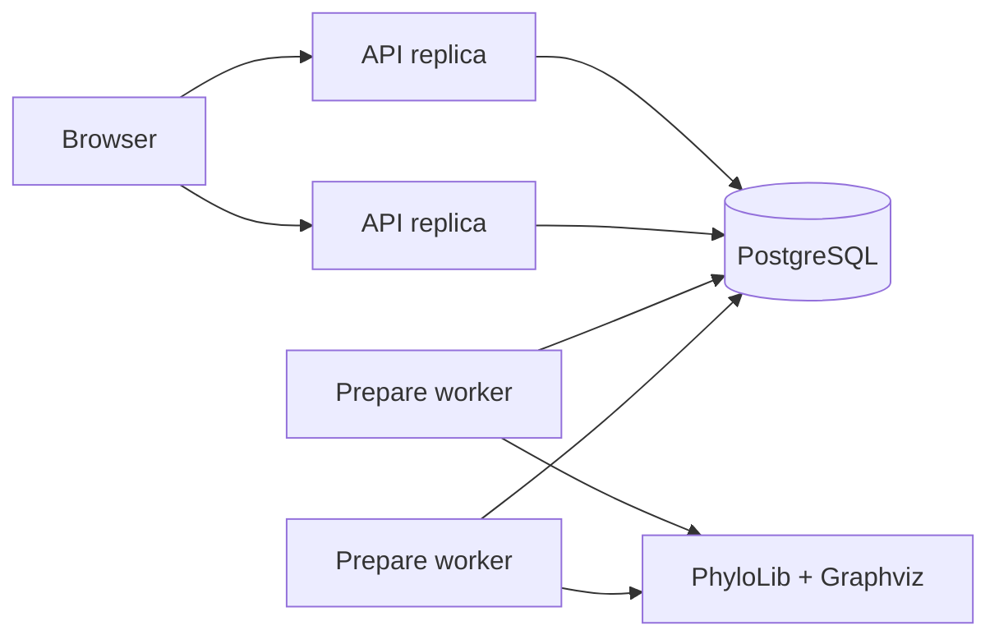

# Architecture

PhyloLens is a two-part system:

1. an embeddable browser library for interaction and rendering;
2. an API service for computational preparation and graph queries.

The boundary is intentional. Global topology, layout, LoD construction, and
persistence remain server-side. Camera state, semantic-zoom preference, visual
mapping, and rendering remain browser-side; the service selects the effective
LoD tier from viewport representation counts.


```mermaid
flowchart LR
  Host[Host application] --> View[PhyloLens view]
  View --> Workbench[Workbench and viewport controller]
  Workbench --> Renderer[Sigma renderer adapter]
  Workbench -->|HTTP API v1| HTTP[HTTP layer]
  HTTP --> Services[Application services]
  Services --> Repository[Layout repository]
  Repository --> Database[(SQLite or PostgreSQL)]
  Services -->|submit and poll| Jobs[Job infrastructure]
  Jobs -->|execute preparation| Services
  Services --> Pipeline[Preparation computations]
  Pipeline --> PhyloLib[PhyloLib JAR]
  Pipeline --> Graphviz[Graphviz sfdp]
  Domain[Shared immutable domain values and invariants]
  HTTP -.-> Domain
  Services -.-> Domain
  Pipeline -.-> Domain
  Repository -.-> Domain
```

## Architectural objectives

### Keep the host integration small

The public package surface is centered on:

```ts
const view = createPhyloLensView({ container, apiUrl });
await view.load(input);
const png = await view.exportPng();
view.dispose();
```

Host applications do not construct transport clients, polling loops, renderer
factories, or layout-version state.

### Move global computation out of the browser

The service performs operations that require the complete graph:

- normalization and validation;
- typing-profile conversion;
- global layout;
- cluster hierarchy construction;
- per-tier quotient-edge construction;
- persistent metadata aggregation.

The browser receives prepared graph slices rather than deriving topology from
partial data.

### Precompute once, query repeatedly

Preparation materializes a content-derived layout version. Interactive requests
reuse persisted positions, clusters, edges, and metadata. This avoids rerunning
global layout on camera movement.

### Bound interactive payloads

Viewport and region queries accept node budgets and return truncation metadata.
The service may add neighbour nodes required to preserve visible edge endpoints,
and explicit cluster expansion may return an entire cluster.

### Preserve renderer isolation

Sigma and Graphology are hidden behind the internal renderer adapter. The HTTP
contract and public package API do not expose Sigma classes or Graphology data
structures.

## Component responsibilities

### Browser library

| Component | Responsibility |
| --- | --- |
| `phyloLensView.ts` | Public lifecycle facade and disposed/superseded load semantics |
| `api/` | HTTP transport, runtime response guards, service compatibility check |
| `app/workbench/` | Dataset preparation workflow, filters, navigation and controller ownership |
| `app/workbench/viewport/` | Camera-to-query mapping, viewport refresh, cluster expansion/collapse |
| `render/` | Renderer-neutral graph contracts and visual mappings |
| `render/adapters/sigma/` | Sigma instance, Graphology graph and browser event integration |
| `ancillary/` | Metadata indexes and client-side filters |

Dependency direction:

```text
public view
  → workbench
    → graph client
    → viewport controller
    → renderer interface
      → Sigma adapter
```

The renderer adapter does not own service requests. The viewport controller does
not expose Sigma-specific objects to the workbench.

### API service

| Layer | Responsibility |
| --- | --- |
| `http/` | FastAPI DTOs, dependency injection, response mapping and HTTP errors |
| `services/` | Application orchestration for preparation, status, reads and ancillary replacement |
| `domain/` | Immutable graph/ancillary/query values, invariants, identity and pure policies |
| `data/` | Newick/typing/ancillary parsing and PhyloLib integration |
| `pipeline/` | Source ingestion, rooted subtree LoD, quotient edges and layout computation |
| `jobs/` | Local admission/executors/futures and durable status/lease/heartbeat orchestration |
| `repository/layout/` | Shared reads/writes, row mapping and backend-owned transactions |
| `repository/jobs/` | Durable PostgreSQL job SQL and payload mapping |
| `database/` | Driver connections, fixed-query dialect handling and schema initialization |
| `config/` | Deployment configuration and timeout parsing |

Dependency direction:

```text
HTTP → Services → Repository → Database
       Domain values and invariants are shared

Preparation service → computational pipeline
Preparation service → repository staging/publication
Job infrastructure → preparation service execution
```

Services have no HTTP dependency. Domain has no dependency on HTTP, services,
persistence, job orchestration or the preparation pipeline. Search and region
read directly through repositories. SQLite and PostgreSQL share retrieval and
annotation assembly while retaining their parameter, ID-query and transaction
strategies. Source-table handling for ancillary replacement does not require the
graph preparation pipeline.

Internal Python import paths are not supported public contracts. Repository-local
consumers use the current module owners; no old-path adapters or naming aliases
remain. Compatibility decoding is limited to public HTTP and persisted payload
boundaries, with deterministic fingerprint encodings preserved.

## Deployment modes

### Local/single-service mode


```mermaid
flowchart LR
  Browser --> API[FastAPI service]
  API --> Registry[In-process job registry]
  Registry --> Worker[Thread-pool worker]
  Worker --> SQLite[(SQLite layout store)]
  API --> SQLite
```

Characteristics:

- one service process owns job state;
- preparation runs in an in-process worker;
- prepared layouts persist in SQLite;
- local capacity is reserved before normalization, including typing-data work;
- suitable for development, evaluation, and single-instance deployment.

### Distributed PostgreSQL mode


```mermaid
flowchart LR
  Browser --> API1[API replica]
  Browser --> API2[API replica]
  API1 --> PG[(PostgreSQL)]
  API2 --> PG
  Worker1[Prepare worker] --> PG
  Worker2[Prepare worker] --> PG
  Worker1 --> Tools[PhyloLib + Graphviz]
  Worker2 --> Tools
```

Characteristics:

- API replicas submit and poll durable jobs;
- workers claim jobs with `FOR UPDATE SKIP LOCKED`;
- leases and heartbeats fence publication;
- prepared artifacts and job state share one database;
- schema initialization is explicit and checksum-verified.

## Runtime boundaries

### Public browser boundary

Only package-root exports are supported. Internal paths are not compatibility
contracts.

The public view can return a PNG `Blob` of its currently materialized canvas
view. PNG export preserves the current camera and semantic-zoom slice by
compositing the visible Sigma canvas layers. SVG is deliberately not exposed:
the current renderer uses WebGL and custom programs, so a faithful vector export
would require reconstructing that materialized rendering as vector geometry.

### HTTP boundary

The browser and service communicate through API contract version `1`. npm and
service implementation versions may differ as long as they implement the same
contract.

### Preparation boundary

A `Dataset` is the last input-oriented representation. The preparation
service computes artifacts and stages/publishes them through repositories. Interactive reads never accept
raw Newick or typing profiles.

### Renderer boundary

Viewport responses are converted to renderer-neutral positioned graphs before
the Sigma adapter applies them to Graphology.

## Dataset and layout identity

`dataset_id` is caller supplied. `layout_version` is a deterministic fingerprint
of the persisted preparation input:

- explicit pipeline version;
- canonical nodes and edges;
- edge distances;
- explicit `technical_roots` and the source `rooting_strategy`;
- metadata schema and values;
- ancillary rows;
- source format and provenance.

Dictionary key order and input object insertion order do not change the
fingerprint. Metadata changes invalidate reuse. Changing the resolved technical
root changes `layout_version`; the generated timestamp is not part of the
fingerprint.

The pair `(dataset_id, layout_version)` identifies one immutable prepared
layout. Reads that omit `layout_version` resolve the latest published `ready` or
`degraded` version.

## Preparation publication model

The preparation service stages a version as `refining`, persists the artifact
tables in repository transactions, then publishes it as `ready`. Readers select
only `ready` or legacy `degraded` versions as the latest layout. Ownership checks
and publication are separate operations, not an atomic stale-worker fence.

When preparing a different identity, an incomplete version does not replace the
previous published version selected by latest-version reads.

## Core correctness invariants

- Every graph edge references existing nodes.
- Supplied edge distances entering preparation are finite and non-negative;
  absent Newick distances remain absent.
- A layout version changes when any persisted input changes.
- Every returned viewport edge references returned nodes.
- Cluster expansion preserves external connectivity through server-computed
  meta-edges.
- Published ancillary schemas and search matching exclude internal summary
  keys. Viewport metadata and region aggregates may retain count projections
  for category and represented-isolate summaries.
- Local completed jobs do not retain complete prepared graphs after compact typed
  summary extraction.
- Only the most recent browser `load()` may commit renderer state.
- `load()` resolves after the first viewport snapshot is applied.

## Performance model

The architecture separates two cost classes.

### Preparation cost

Preparation has access to the complete graph and includes:

- parsing and normalization;
- optional PhyloLib subprocesses;
- technical deterministic orientation of potentially unrooted trees/MSTs;
- hop-defined pendant-subtree construction, independent of branch distance;
- multiplicative-nearest geometric representation growth to select materialized cuts, without a fixed level cap;
- Graphviz global layout;
- per-tier edge construction;
- metadata aggregation;
- persistence.

### Interaction cost

Interactive operations read persisted data:

- viewport query by bounds and LoD tier;
- cluster expansion by cluster ID;
- region query by bounds;
- node/metadata search.

Database indexes and response budgets are intended to make interaction cost track
the selected slice rather than require global recomputation. The thesis
evaluation must quantify the actual latency, memory, and scaling behavior.

## Related documents

- [Runtime flow](flow.md)
- [Input formats](INPUT_FORMATS.md)
- [API reference](API_REFERENCE.md)
- [Data model](DATA_MODEL.md)
- [Server preparation pipeline](SERVER_PIPELINE.md)
- [LoD and clustering](LOD_AND_CLUSTERING.md)
- [Client rendering](CLIENT_RENDERING.md)

### Structural visibility and viewport scale

Full structural detail represents every original canonical node individually.
The LoD policy selects valid hop-depth resolutions and cannot remove topology's
intrinsic branching jumps. Normal queries use LoD and viewport bounds, without
arbitrary count truncation after selecting a tier. Optional explicit caller
limits produce partial responses; they have no fixed server upper bound.

Interaction combines semantic zoom with viewport-aware tier selection. Zoom
supplies a preferred tier; spatial representation counts can defer it in dense
regions or refine beyond it in sparse ones. Each tier ahead of the preference
halves the screen-area target, requiring progressively more spare capacity. The configurable target derives from
screen area, with hysteresis around density transitions. Retrieval then applies
padded spatial bounds at the effective tier. Complexity targets select complete
structural resolutions and never truncate them. Topological branching jumps can
still exceed the target at the coarsest valid level.
