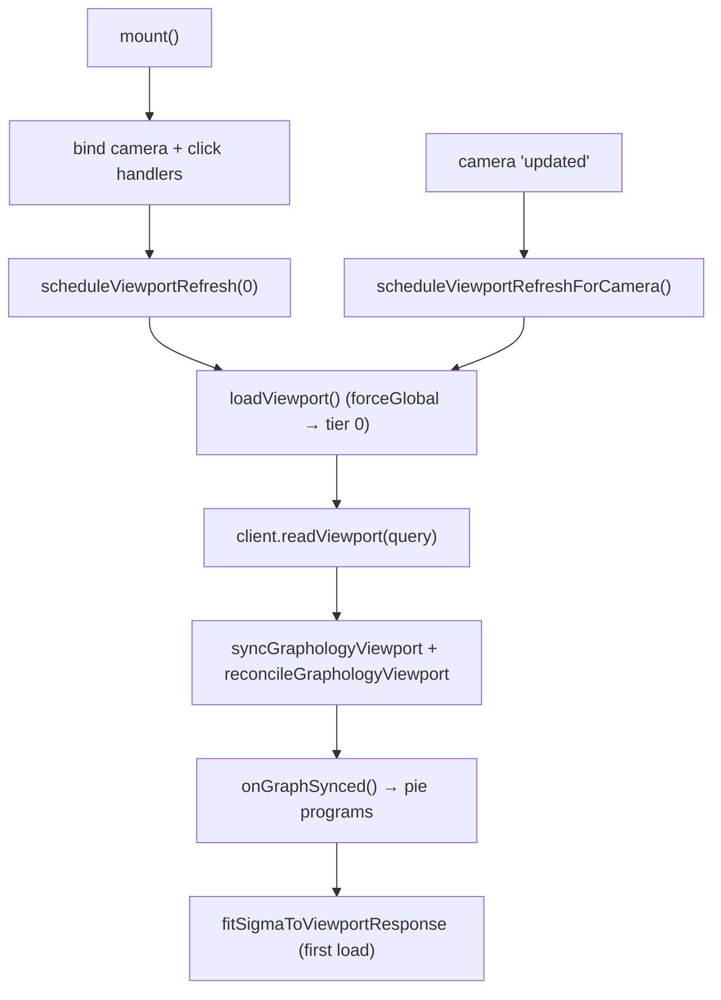

# Client Rendering

The client renders with Sigma.js over a Graphology graph. The workbench prepares
a dataset and starts a viewport-sync loop; `GraphViewerV2` keeps the Graphology
graph in step with the camera by pulling viewport slices from the server and
reconciling them into the graph. This document covers the viewer lifecycle,
node/edge attribute derivation, the triangle rule, and PHYLOViZ coloring.

For how zoom picks a tier, see [`LOD_AND_CLUSTERING.md`](./LOD_AND_CLUSTERING.md);
for expand/collapse, see [`EXPAND_COLLAPSE.md`](./EXPAND_COLLAPSE.md).

## Viewer Lifecycle (`GraphViewerV2.ts`)

`GraphViewerV2` is constructed by the Sigma adapter's
`startGraphV2ViewportSync`. Key options: `datasetId`, `layoutVersion`, `client`
(`GraphV2Client`), `graph` (Graphology), `sigma`, `maxNodes`, and
`lodTierCount` (from the prepare response, normalized to `>= 1`).



- **`mount()` / `unmount()`** bind and unbind camera/click handlers, manage
  timers, and bump a request sequence so stale in-flight responses are dropped.
- **`scheduleViewportRefreshForCamera()`** short-circuits when paused
  (`getPaused()`) or when a small tree is already fully loaded, detects a LoD
  tier change, and schedules a refresh — `60ms` for tier changes, `120ms` for
  same-tier pans. At tier 0 a same-tier pan is skipped (the overview carries no
  bounds); at finer tiers a same-tier pan schedules a bounded refetch so panning
  reveals new nodes (see [`LOD_AND_CLUSTERING.md`](./LOD_AND_CLUSTERING.md)).
- **`loadViewport()`** builds the query (`buildGraphV2ViewportQuery`), records
  `lastRequestedLodLevel` (the hysteresis anchor), reads the slice, then syncs
  and reconciles into the graph. On the first tier-0 load it fits the camera.
- **`rebindSigma()`** re-attaches handlers when Sigma is rebuilt (e.g. after a
  piechart program registration).

`lodTierCount` and `lastRequestedLodLevel` are threaded into
`buildGraphV2ViewportQuery`, which calls
`semanticLodLevelForCameraRatioWithHysteresis` to pick the tier and expands the
query bounds by `GRAPH_VIEWER_V2_VIEWPORT_PADDING_RATIO = 0.5` for tiers > 0.

## Sync and Reconcile (`graphViewerV2Sync.ts`)

- **`syncGraphologyViewport(graph, response, settings?)`** filters nodes by any
  active metadata filter (`matchesFilterState`), resolves visual-mapping palette
  when active, then upserts each node and edge. `upsertGraphNode` merges only
  changed attributes to emit a single Graphology event instead of one per field.
- **`reconcileGraphologyViewport(...)`** drops nodes and edges not present in the
  response — this is what makes the graph track the moving viewport instead of
  accumulating stale geometry. It **suspends Sigma's `nodeDropped`/`edgeDropped`
  listeners** for the batch: each of those handlers otherwise calls `refresh()`
  with no `partialGraph`, forcing a full O(N+E) Sigma re-index *per drop event*.
  Dropping thousands of elements one at a time turned into thousands of full
  re-indexes (the O(n²) fingerprint — a ~6.5s stall observed on large tier
  transitions). The batch drops edges first, then nodes (so `dropNode` has no
  incident edges to cascade through), restores the listeners in a `finally`, and
  the single `sigma.refresh()` the caller already runs afterward does one correct
  re-index.

## The Triangle Rule

A node renders as a **triangle** (cluster proxy) when it represents more than one
underlying node. In `graphNodeAttributes`:

```typescript
const isRepresentative = node.is_representative || node.member_count > 1;
// ...
type: isRepresentative ? SIGMA_NODE_TYPE_TRIANGLE : undefined; // else "circle"
```

`isExpandableRepresentative` uses the same idea for click-to-expand eligibility
(`type === "triangle"`, `is_cluster_proxy === true`, or `member_count > 1`).

Node size grows with cluster size but is capped:
`nodeSizeForMemberCount(n) = 5 + min(6, (sqrt(n) - 1) * 1.25)`, so even a huge
cluster never dominates the canvas.

## Node Coloring

Color precedence in `graphNodeAttributes` (highest first):

1. **Active visual mapping** — an explicit user choice; color comes from
   `deriveColor(metadata[colorField], palette)`.
2. **Representative tone** — cluster proxies (triangles) use
   `GRAPH_VIEWER_V2_REPRESENTATIVE_COLOR = "#b45309"` (amber/brown), so they read
   as aggregates rather than leaf nodes.
3. **PHYLOViZ role color** — leaf/member nodes fall through to
   `deriveViewportNodeColor(node)`.

### PHYLOViZ role colors (`deriveViewportNodeColor`)

Roles are read from node metadata under any of the genuine PHYLOViZ role aliases
`phyloviz_role`, `st_role`, `node_role`, `role` (via `firstAttributeValue`),
normalized by `normalizeRoleValue` (lowercases, collapses separators, maps
`founder`/`sub_founder`/`subgroup`/`common_node` aliases). The generic
`category` and `type` field names are **not** role keys: the server's
`aggregate_cluster_metadata` stores a mode value under whatever fields a dataset
happens to carry, so treating them as roles mis-tinted ordinary nodes green.
Resolution order:

| Condition | Color constant | Hex | Meaning |
| --- | --- | --- | --- |
| `selected` / `is_selected` truthy | `PHYLOVIZ_NODE_SELECTED_COLOR` | `#dc2626` | red — selected |
| role `group_founder` (or founder flags) | `PHYLOVIZ_NODE_GROUP_FOUNDER_COLOR` | `#86efac` | light green |
| role `subgroup_founder` (or flags) | `PHYLOVIZ_NODE_SUBGROUP_FOUNDER_COLOR` | `#15803d` | dark green |
| otherwise | `PHYLOVIZ_NODE_COMMON_COLOR` | `#93c5fd` | blue — common |

`GRAPH_VIEWER_V2_NODE_COLOR` equals `PHYLOVIZ_NODE_COMMON_COLOR`, so a node with
no role stays the common blue. These hex codes mirror the original PHYLOViZ
goeBURST conventions. Edges use `GRAPH_VIEWER_V2_EDGE_COLOR = "#94a3b8"`;
edge-tiebreak color constants for goeBURST link rules also live in
`sigmaRenderingConstants.ts`.

## Camera Fit (`graphViewerV2Fit.ts`)

- **`fitSigmaToViewportResponse`** — after the first tier-0 load, fits the
  overview into view after `GRAPH_VIEWER_V2_INITIAL_FIT_DELAY_MS = 50ms` with a
  `300ms` animation and `GRAPH_VIEWER_V2_FIT_PADDING_RATIO = 1.15` padding.
- **`fitSigmaToClusterResponse`** — frames a set of opened members with
  `GRAPH_VIEWER_V2_CLUSTER_FIT_PADDING_RATIO = 1.35` over a `350ms` animation.
  The helper remains available, but the click-to-expand flow no longer calls it:
  expansion adds members in place and leaves the camera untouched so the
  surrounding graph stays visible (see [`EXPAND_COLLAPSE.md`](./EXPAND_COLLAPSE.md)).

## Pie Programs (`sigmaRenderer.ts`)

After each sync, `onGraphSynced` triggers `syncPieProgramsFromGraph`, which
detects the pie-slice keys present in the live graph and rebuilds the Sigma
instance only when the program signature changed, then rebinds `GraphViewerV2`
to the new instance. When pie charts are disabled the work is skipped.
