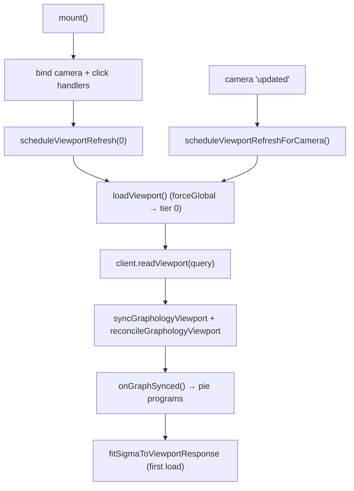

# Client Rendering

The client renders with Sigma.js over a Graphology graph. The workbench prepares
a dataset and starts a viewport-sync loop; `GraphViewportController` keeps the
Graphology graph in step with the camera by pulling viewport slices from the
server and reconciling them into the graph. This document covers the viewport
lifecycle, node/edge attribute derivation, the triangle rule, PHYLOViZ +
value-based coloring, pie programs, and region (box) selection.

For how zoom picks a tier, see [`LOD_AND_CLUSTERING.md`](./LOD_AND_CLUSTERING.md);
for expand/collapse, see [`EXPAND_COLLAPSE.md`](./EXPAND_COLLAPSE.md).

## Viewport Lifecycle (`render/adapters/sigma/viewport/graphViewportController.ts`)

`GraphViewportController` is constructed by the Sigma adapter's
`startGraphViewportSync`. Key options: `datasetId`, `layoutVersion`, `client`
(`GraphClient`), `graph` (Graphology), `sigma`, `maxNodes`, and
`lodTierCount` (from the prepare response, normalized to `>= 1`).



- **`mount()` / `unmount()`** bind and unbind camera/click handlers, manage
  timers, and bump a request sequence so stale in-flight responses are dropped.
- **`scheduleViewportRefreshForCamera()`** short-circuits when paused
  (`getPaused()`) or when a small tree is already fully loaded, detects a LoD
  tier change, and schedules a refresh — `60ms` for tier changes, `120ms` for
  same-tier pans. At tier 0 a same-tier pan is skipped (the overview carries no
  bounds); at finer tiers a same-tier pan schedules a bounded refetch so panning
  reveals new nodes (see [`LOD_AND_CLUSTERING.md`](./LOD_AND_CLUSTERING.md)).
- **`loadViewport()`** builds the query (`buildGraphViewportQuery`), records
  `lastRequestedLodLevel` (the hysteresis anchor), reads the slice, then syncs
  and reconciles into the graph. On the first tier-0 load it fits the camera.
- **`rebindSigma()`** re-attaches handlers when Sigma is rebuilt (e.g. after a
  piechart program registration).

`lodTierCount` and `lastRequestedLodLevel` are threaded into
`buildGraphViewportQuery`, which calls
`semanticLodLevelForCameraRatioWithHysteresis` to pick the tier and expands the
query bounds by `GRAPH_VIEWER_VIEWPORT_PADDING_RATIO = 0.5` for tiers > 0.

## Sync and Reconcile (`render/adapters/sigma/viewport/graphViewportSync.ts`)

- **`syncGraphologyViewport(graph, response, settings?)`** filters nodes by any
  active metadata filter (`matchesFilterState`), resolves visual-mapping palette
  when active, then upserts each node and edge. Node attributes are built in
  `graphViewportNodeAttributes.ts`; edge attributes are built in
  `graphViewportEdgeAttributes.ts`. `upsertGraphNode` merges only changed
  attributes to emit a single Graphology event instead of one per field.
- **`reconcileGraphologyViewport(...)`** drops nodes and edges not present in the
  response — this is what makes the graph track the moving viewport instead of
  accumulating stale geometry. It **suspends Sigma's `nodeDropped`/`edgeDropped`
  listeners** for the batch: each of those handlers otherwise calls `refresh()`
  with no `partialGraph`, forcing a full O(N+E) Sigma re-index _per drop event_.
  Dropping thousands of elements one at a time turned into thousands of full
  re-indexes (the O(n²) fingerprint — a ~6.5s stall observed on large tier
  transitions). The batch drops edges first, then nodes (so `dropNode` has no
  incident edges to cascade through), restores the listeners in a `finally`, and
  the single `sigma.refresh()` the caller already runs afterward does one correct
  re-index.

## The Triangle Rule

A node renders as a **triangle** (cluster proxy) when it represents more than one
underlying node. In `buildGraphViewportNodeAttributes`:

```typescript
const isRepresentative = node.member_count > 1;
// ...
type: isRepresentative ? SIGMA_NODE_TYPE_TRIANGLE : undefined; // else "circle"
```

`isExpandableRepresentative` uses the same idea for click-to-expand eligibility
(`type === "triangle"`, `is_cluster_proxy === true`, or `member_count > 1`).

Node size grows with cluster size but is capped:
`nodeSizeForMemberCount(n) = 5 + min(6, (sqrt(n) - 1) * 1.25)`, so even a huge
cluster never dominates the canvas.

## Node Coloring

Color precedence in `buildGraphViewportNodeAttributes` (highest first):

1. **Active visual mapping, when the node has a value for the color field** — an
   explicit user choice. Color comes from a graph-wide, frequency-ranked map
   (see [Value Color Unification](#value-color-unification) below), not a hash.
2. **Representative tone** — cluster proxies (triangles) use
   `GRAPH_VIEWER_REPRESENTATIVE_COLOR = "#b45309"` (amber/brown), so they read
   as aggregates rather than leaf nodes.
3. **PHYLOViZ role color** — leaf/member nodes fall through to
   `deriveViewportNodeColor(node)`. A node with **no value** for the active color
   field also lands here: it keeps its role color rather than being painted a
   palette slot it does not belong to (which could collide with a real value).

### Value Color Unification (`render/mapping/colorMapping.ts`)

Node fills, on-node pie slices, and the ancillary wheel share **one** color
source so a clicked node always matches its wheel slice.
`buildValueColorMap(values, palette)` counts each value across the graph, ranks
them most-frequent-first (ties broken by label ascending), and assigns
`palette[0]`, `palette[1]`, … in order; values past the palette collapse to a
stable grey "Others". `DEFAULT_COLOR_PALETTE` carries 12 visually distinct hues,
so the top-12 legend has no repeats. The wheel builders
(`ancillaryWheel.ts` → `resolvePieSliceColors`) rank the same way, per field, and
honor live palette / category-color overrides forwarded from the shell so a
color edit repaints tree and wheel together.

### PHYLOViZ role colors (`deriveViewportNodeColor`)

Roles are read from node metadata under any of the genuine PHYLOViZ role aliases
`phyloviz_role`, `st_role`, `node_role`, `role` (via `firstAttributeValue`),
normalized by `normalizeRoleValue` (lowercases, collapses separators, maps
`founder`/`sub_founder`/`subgroup`/`common_node` aliases). The generic
`category` and `type` field names are **not** role keys: the server's
`aggregate_cluster_metadata` stores a mode value under whatever fields a dataset
happens to carry, so treating them as roles mis-tinted ordinary nodes green.
Resolution order:

| Condition                               | Color constant                         | Hex       | Meaning        |
| --------------------------------------- | -------------------------------------- | --------- | -------------- |
| `selected` / `is_selected` truthy       | `PHYLOVIZ_NODE_SELECTED_COLOR`         | `#dc2626` | red — selected |
| role `group_founder` (or founder flags) | `PHYLOVIZ_NODE_GROUP_FOUNDER_COLOR`    | `#86efac` | light green    |
| role `subgroup_founder` (or flags)      | `PHYLOVIZ_NODE_SUBGROUP_FOUNDER_COLOR` | `#15803d` | dark green     |
| otherwise                               | `PHYLOVIZ_NODE_COMMON_COLOR`           | `#93c5fd` | blue — common  |

`GRAPH_VIEWER_NODE_COLOR` equals `PHYLOVIZ_NODE_COMMON_COLOR`, so a node with
no role stays the common blue. These hex codes mirror the original PHYLOViZ
goeBURST conventions. Edges use `GRAPH_VIEWER_EDGE_COLOR = "#94a3b8"`;
edge-tiebreak color constants for goeBURST link rules also live in
`sigmaRendering.constants.ts`.

## Camera Fit (`render/adapters/sigma/viewport/graphViewportFit.ts`)

- **`fitSigmaToViewportResponse`** — after the first tier-0 load, fits the
  overview into view after `GRAPH_VIEWER_INITIAL_FIT_DELAY_MS = 50ms` with a
  `300ms` animation and `GRAPH_VIEWER_FIT_PADDING_RATIO = 1.15` padding.
- **`fitSigmaToClusterResponse`** — frames a set of opened members with
  `GRAPH_VIEWER_CLUSTER_FIT_PADDING_RATIO = 1.35` over a `350ms` animation.
  The helper remains available, but the click-to-expand flow no longer calls it:
  expansion adds members in place and leaves the camera untouched so the
  surrounding graph stays visible (see [`EXPAND_COLLAPSE.md`](./EXPAND_COLLAPSE.md)).

## Pie Mapping and Programs

Pie mapping is split by responsibility:

- `render/mapping/pieMapping.ts` is the public facade that builds node pie
  attributes from metadata.
- `render/mapping/pieCategoryCounts.ts` parses and combines categorical-count
  metadata.
- `render/mapping/pieColors.ts` detects active slice keys and resolves slice
  colours.
- `render/adapters/sigma/programs/sigmaPiePrograms.ts` adapts those slice keys
  into Sigma node programs.

After each sync, `onGraphSynced` triggers `syncPieProgramsFromGraph`, which
detects the pie-slice keys present in the live graph and rebuilds the Sigma
instance only when the program signature changed, then rebinds
`GraphViewportController` to the new instance. When pie charts are disabled the
work is skipped.

## Region Selection (`render/adapters/sigma/interaction/sigmaBoxSelectController.ts`)

Holding **Shift** and dragging draws a selection box over the canvas (or plain
drag when region-select mode is toggled on via
`setRegionSelectModeEnabled`). `sigmaBoxSelectController.ts` tracks the drag,
suppresses camera panning while a box is active, converts the screen rectangle
into graph-space bounds, and hands them to the workbench. The workbench issues a
`readRegion` call (`POST /api/graph/region`), which returns the isolated
subgraph inside the box plus `aggregated_metadata` (mode for
categorical/boolean, mean for numeric). `app/shell/region/regionPanelView.ts`
renders that result as a region-selection summary with its own ancillary wheel,
reusing the same value-color map as the tree. A new dataset or re-render clears
the active selection. Region reads are always finest-detail (no `zoom`/
`lod_level`), independent of the semantic-zoom loop.

## Consuming the Client as a Library

The client ships as an installable package (`phylo-lens-client`), not just the
demo app. A host application such as PHYLOViZ mounts the renderer as a component
and never has to touch the HTTP contract itself — the workbench drives the whole
prepare → poll → viewport loop internally. The package externalizes the
rendering stack (`sigma`, `graphology`, `graphology-layout-force`,
`graphology-layout-forceatlas2`, `@sigma/node-border`, `@sigma/node-piechart`)
as **peer dependencies**, so the host provides a single shared copy of Sigma and
Graphology rather than bundling a duplicate.

Build the package with `npm run build:lib`, which emits `dist/index.js` (ESM) via
`vite.lib.config.ts` and `dist/types/**/*.d.ts` declarations via
`tsconfig.lib.json`. The demo build (`npm run build`, `index.html`) is untouched.

### Public facade

Host applications consume the package root through `createPhyloLensView`. The
host provides a DOM container, the PhyloLens API service URI, and dataset content;
transport, prepare polling, renderer selection, prepared dataset ids, layout
versions, and viewport synchronization stay inside the library.

The lower transport, workbench, renderer, and shell modules remain internal
implementation layers. The demo shell is a reference application, not the
recommended integration API.

### One-call `load`

```ts
import { createPhyloLensView } from "phylo-lens-client";

const container = document.getElementById("graph-root");
if (!(container instanceof HTMLElement)) {
  throw new Error("Missing graph container.");
}

const view = createPhyloLensView({
  container,
  apiUrl: "http://localhost:8000",
});

// Submits the tree, polls prepare to 'ready', starts the viewport-sync loop,
// and paints into the container. The host never sees a job id or a poll.
await view.load({
  content: newickString,
  name: "my-dataset",
  metadataSchema,
  metadataByNodeId,
  visualMapping: { colorField: "region" }, // size defaults to profile_count
});

// Later, on teardown:
view.dispose();
```

`load` accepts metadata, ancillary CSV/TSV joins, visual mapping, layout
iterations, and LoD tuning. Colour defaults to the `region` field and size
defaults to `profile_count` (falling back to branch `distance`), matching
PHYLOViZ conventions. See [`API_REFERENCE.md`](./API_REFERENCE.md) for the
underlying service contract.
