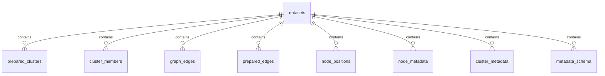

# Data model and persistence

PhyloLens uses separate models for normalized input, prepared layout artifacts,
and HTTP responses. This separation prevents source-format concerns from leaking
into layout and rendering code.

```text
raw Newick / typing profiles / metadata
  → CanonicalDataset
  → PreparedLayoutArtifacts
  → persisted layout version
  → viewport, region, and search responses
```

## Canonical domain model

The canonical model is defined in `domain/models.py` and is the only graph shape
accepted by the preparation pipeline.

### `CanonicalDataset`

| Field | Type | Meaning |
| --- | --- | --- |
| `dataset_id` | `str` | Caller-supplied dataset name and namespace |
| `nodes` | `list[CanonicalNode]` | Canonical graph nodes |
| `edges` | `list[CanonicalEdge]` | Canonical graph edges |
| `metadata_schema` | `list[MetadataField]` | Public scalar metadata fields |
| `metadata_by_node_id` | `dict[str, dict]` | Aggregated metadata for each node |
| `ancillary_rows_by_node_id` | `dict[str, list[dict]]` | Original ancillary rows joined to each node |
| `source` | `DatasetSource` | Source format, generation timestamp, and optional provenance |

### `CanonicalNode`

| Field | Type | Meaning |
| --- | --- | --- |
| `id` | non-empty `str` | Stable canonical identifier |
| `x`, `y` | `float | None` | Optional source-provided coordinates |
| `cluster_id` | `str | None` | Optional topology hint |
| `is_cluster_proxy` | `bool | None` | Optional source hint |
| `is_cluster_skeleton` | `bool | None` | Optional source hint |
| `subtree_size` | positive `int | None` | Optional structural metric |
| `leaf_count` | positive `int | None` | Optional structural metric |

Newick and typing-data normalization currently produce topology and identifiers;
coordinates are normally assigned later by the layout pipeline.

### `CanonicalEdge`

| Field | Type | Meaning |
| --- | --- | --- |
| `id` | non-empty `str` | Deterministic edge identifier |
| `source` | non-empty `str` | Source node identifier |
| `target` | non-empty `str` | Target node identifier |
| `distance` | non-negative `float | None` | Branch or allelic distance |

Every edge entering preparation must reference existing nodes and carry a finite,
non-negative distance. Normalization assigns a uniform distance only when the
entire input is unweighted; a partially weighted graph is rejected by the
prepare pipeline.

### Metadata types

`MetadataField.type` is one of:

```text
string | number | boolean | null
```

Published metadata schemas exclude internal aggregation fields. Ancillary-row
aggregation uses renderer-only fields for profile counts and category counts.
Those fields may be attached to viewport node and representative metadata, but
they are omitted from the schema, search matching, and region summary output.

## Prepared layout model

Preparation converts a canonical dataset into immutable artifacts identified by
`(dataset_id, layout_version)`.

### `PreparedLayoutArtifacts`

| Field | Type | Meaning |
| --- | --- | --- |
| `dataset` | `CanonicalDataset` | Normalized graph and metadata |
| `layout_version` | `str` | Deterministic preparation fingerprint |
| `clusters` | `tuple[PreparedCluster, ...]` | Clusters materialized across distance thresholds |

### `PreparedCluster`

| Field | Type | Meaning |
| --- | --- | --- |
| `cluster_id` | `str` | Deterministic identifier derived from threshold and members |
| `threshold` | `float | None` | Distance threshold associated with the cluster |
| `member_node_ids` | `tuple[str, ...]` | Canonical member nodes |
| `representative_node_id` | `str` | Member used as the visible representative |
| `internal_edge_ids` | `tuple[str, ...]` | Original edges contained by the cluster |
| `boundary_edge_ids` | `tuple[str, ...]` | Original edges crossing the cluster boundary |

Representative selection is deterministic. When source coordinates are
available, the representative is closest to the member centroid, with internal
degree and identifier tie-breaks. Without source coordinates, the member with
the highest internal degree is selected, then the lexicographically smallest
identifier.

### Layout records

`ClusterLayout` stores one representative position and spatial extent for a
cluster:

- `x`, `y`;
- `radius`;
- `bounds`;
- `member_count`;
- `status`.

`NodeLayoutPosition` stores the finest-detail coordinates of one canonical node.
`PreparedEdge` stores one quotient edge for one LoD level.

### Layout status

```text
pending | refining | ready | degraded | failed
```

Current preparation publishes `ready` only. `degraded` is retained for layouts
created by earlier service versions and is not produced as a Graphviz fallback.
`pending` and `refining` describe in-flight work. `failed` is a terminal job
state and is not published as a readable layout version.

## Read models

Repository readers return server-internal result objects before HTTP mapping.

### `ViewportNode`

| Field | Meaning |
| --- | --- |
| `node_id` | Visible node or representative identifier |
| `cluster_id` | Cluster represented by the node; finest-detail nodes retain their cluster association |
| `x`, `y` | Global prepared-layout coordinates |
| `layout_status` | Status of the published layout |
| `member_count` | Number of canonical nodes represented; `1` at finest detail |
| `is_representative` | Whether the node represents a multi-node cluster |
| `metadata` | Node or cluster metadata visible to the caller |

### `ViewportEdge`

Ordinary edges preserve original endpoints and distance. Meta-edges produced by
cluster expansion additionally expose:

- `is_meta = true`;
- `bundled_edge_count`, the number of original boundary edges represented.

### `ViewportReadResult`

A viewport result includes:

- visible nodes and edges;
- `total_node_count` before the response budget is applied;
- `truncated`;
- `layout_status`;
- global layout bounds;
- public metadata schema.

### `RegionReadResult`

Region reads return finest-detail nodes within a rectangular selection and add
`aggregated_metadata`:

- numeric fields: arithmetic mean of non-null values;
- categorical and boolean fields: mode, with deterministic tie-breaking.

### Search results

`SearchMatch` contains the canonical node identifier, score, matched text,
cluster association, metadata, and global position when available. Search does
not return generated union identifiers as user-facing matches.

## Layout identity

`layout_version` is a SHA-256-derived fingerprint of all persisted preparation
inputs and `LAYOUT_PIPELINE_VERSION`.

The fingerprint includes:

- dataset identifier;
- sorted node and edge records;
- distances;
- public metadata schema;
- node metadata;
- ancillary rows;
- source format and stable provenance fields.

The generated timestamp is excluded. JSON keys and collections are ordered
canonically, so Python dictionary insertion order does not affect identity.
Metadata changes therefore invalidate reuse even when topology remains the same.

## Persistence model

PhyloLens provides the same logical artifact model through SQLite and
PostgreSQL.

- **SQLite** supports the in-process service mode.
- **PostgreSQL** supports durable job coordination and multiple API/worker
  processes.

All artifact tables are keyed by `(dataset_id, layout_version)`.



| Table | Purpose |
| --- | --- |
| `datasets` | Publication status and timestamps for each layout version |
| `prepared_clusters` | Cluster membership summary, representative, position, radius, and bounds per threshold |
| `cluster_members` | Cluster-to-node membership |
| `graph_edges` | Original canonical graph edges |
| `prepared_edges` | Quotient edges per LoD level |
| `node_positions` | Finest-detail global node coordinates |
| `node_metadata` | Public node metadata encoded as JSON |
| `cluster_metadata` | Aggregated public cluster metadata encoded as JSON |
| `metadata_schema` | Field key and canonical scalar type |

PostgreSQL additionally stores durable prepare jobs and lease state in
`prepare_jobs`.

## Publication semantics

A worker publishes a layout transactionally at the application level:

1. clear any incomplete artifact set for the same identity;
2. create the dataset row with status `refining`;
3. persist canonical artifacts;
4. persist node and cluster layouts;
5. persist prepared quotient edges;
6. change the dataset status to `ready` or `degraded`.

Reads that omit `layout_version` resolve only the latest published version. A
partially written `refining` version cannot replace an earlier readable layout.

## Query indexes

The schema uses ordinary database indexes rather than a separate spatial-index
service. Important access patterns include:

- cluster-bounds overlap at a selected threshold;
- finest-detail node position bounds;
- prepared-edge lookup by visible representatives;
- original-edge lookup by node endpoints;
- metadata and cluster-membership lookup by layout identity.

The concrete SQLite and PostgreSQL schemas are maintained under
`code/server/sql/`.

## Contract boundaries

The canonical and prepared models are internal Python contracts. Browser
applications should depend only on:

- the package-root TypeScript API;
- the versioned HTTP schemas documented in [API reference](./API_REFERENCE.md).

Database tables and internal dataclasses are not public compatibility contracts.
