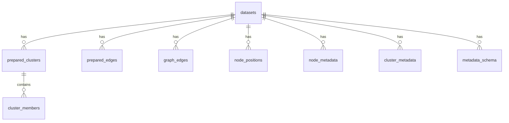

# Data Model

This document defines the data contracts that flow through PhyloLens and the
SQLite schema that persists prepared layouts. It is the reference for
[`ARCHITECTURE_SPEC.md`](./ARCHITECTURE_SPEC.md) and
[`SERVER_PIPELINE.md`](./SERVER_PIPELINE.md).

Three layers of models exist:

1. **Canonical models** — the normalized input (`core/models.py`).
2. **Prepared/layout models** — server-internal materialization records
   (`prepared_layout/models.py`).
3. **Viewport wire models** — the request/response types crossing the HTTP
   boundary (`api/graph.py`, mirrored client-side in `api/graphClient.ts`).

## 1. Canonical Models (`core/models.py`)

### `CanonicalDataset`

The correctness-first normalized representation produced by
`normalize_dataset`. Input to prepare; never shipped whole to the browser.

| Field | Type | Notes |
| --- | --- | --- |
| `dataset_id` | `str` | ≥1 char |
| `nodes` | `list[CanonicalNode]` | graph nodes |
| `edges` | `list[CanonicalEdge]` | graph edges |
| `metadata_schema` | `list[MetadataField]` | field key + type |
| `metadata_by_node_id` | `dict[str, dict]` | per-node metadata values |
| `ancillary_rows_by_node_id` | `dict[str, list[dict]]` | multi-valued metadata |
| `source` | `DatasetSource` | `format`, `generated_at`, `provenance` |

### `CanonicalNode`

`id` (≥1 char), optional `x`/`y`, optional topology hints (`cluster_id`,
`is_cluster_proxy`, `is_cluster_skeleton`), optional metrics (`subtree_size`,
`leaf_count`).

### `CanonicalEdge`

`id` (≥1 char), `source`, `target` (node IDs), `distance` (`float | None`, ≥0).
Distances are the branch lengths used for threshold clustering; the prepare
path requires them (`ensure_graph_edge_distances` fills missing distances
with `1.0` and emits a warning).

`DatasetSource.format` is `SourceFormat` — `"newick"` or `"typing_data"`.

## 2. Metadata Rules

### Internal-key filtering (`core/metadata_keys.py`)

Two families of keys are internal and must never surface in public payloads:

```python
PROFILE_COUNT_FIELD = "profile_count"
CATEGORY_COUNT_FIELD_PREFIX = "__category_count__"

def is_internal_metadata_key(key: str) -> bool:
    return key == PROFILE_COUNT_FIELD or key.startswith(CATEGORY_COUNT_FIELD_PREFIX)
```

They are filtered from `metadata_schema`, node metadata, and cluster metadata.

### Cluster metadata aggregation (`store.aggregate_cluster_metadata`)

A cluster representative summarizes its members' metadata:

- **Numeric fields** (`"number"`): **mean** of non-null values.
- **Categorical / boolean fields** (`"string"`, `"boolean"`): **mode** (most
  common non-null value), with an alphabetical tie-break for determinism.

## 3. Prepared / Layout Models (`prepared_layout/models.py`)

`LayoutStatus = Literal["pending", "refining", "ready", "degraded", "failed"]`.

### `PreparedCluster`

| Field | Type | Notes |
| --- | --- | --- |
| `cluster_id` | `str` | deterministic hash |
| `threshold` | `float \| None` | distance threshold; `None` = finest detail |
| `member_node_ids` | `tuple[str, ...]` | members |
| `representative_node_id` | `str` | member nearest the cluster's layout centroid (not a distance medoid) |
| `internal_edge_ids` | `tuple[str, ...]` | edges within the cluster |
| `boundary_edge_ids` | `tuple[str, ...]` | edges crossing the boundary |
| `member_count` | property | `len(member_node_ids)` |

### `PreparedEdge`

Per-tier quotient edge: `dataset_id`, `layout_version`, `lod_level` (0-based),
`edge_id`, `source`, `target` (representatives at that tier), `distance`.

### `ClusterLayout` / `NodeLayoutPosition`

`ClusterLayout` holds the representative position (`x`, `y`), `radius`, `bounds`
(`min_x/max_x/min_y/max_y`), `member_count`, and `status`. `NodeLayoutPosition`
holds one member's `x`, `y`, `cluster_id`, and `status` at finest detail.

### Viewport read models

- `ViewportNode`: `node_id`, `cluster_id`, `x`, `y`, `layout_status`,
  `member_count` (default 1), `is_representative` (default False), `metadata`.
- `ViewportEdge`: `edge_id`, `source`, `target`, `distance`, `is_meta`
  (default None), `bundled_edge_count` (default None).
- `ViewportReadResult`: `nodes`, `edges`, `total_node_count`, `truncated`,
  `layout_status`, `metadata_schema`.
- `RegionReadResult`: the `ViewportReadResult` fields plus `aggregated_metadata`
  (`dict[str, str | float | bool | None]`) — backs the `/region` box-select read
  (see [§4 Region wire models](#region-wire-models-apigraphpy)).

## 4. Viewport Wire Models

The API maps `ViewportNode`/`ViewportEdge` onto `GraphViewportNode`/
`GraphViewportEdge` almost 1:1. See
[`ARCHITECTURE_SPEC.md`](./ARCHITECTURE_SPEC.md#core-contracts) for the query and
response field lists and [`CLIENT_RENDERING.md`](./CLIENT_RENDERING.md) for how
the client interprets them.

### Region wire models (`api/graph.py`)

The `/region` route (hand-drawn box select) uses its own request/response pair:

- `GraphRegionQuery`: `dataset_id`, optional `layout_version`, required bounds
  `xmin/xmax/ymin/ymax` (validated `xmax >= xmin`, `ymax >= ymin`), and
  `max_nodes` (1–`HARD_MAX_VIEWPORT_NODES`). It carries no `zoom`/`lod_level` —
  a region read is always finest-detail nodes inside the box.
- `GraphRegionResponse`: the viewport response shape (`dataset_id`,
  `layout_version`, `layout_status`, `truncated`, `total_node_count`, `nodes`,
  `edges`, `metadata_schema`) **plus** `aggregated_metadata`
  (`dict[str, str | float | bool | None]`) summarizing the selected nodes — mode
  for categorical/boolean fields, mean for numeric. It is backed by
  `store.read_region`, which returns a `RegionReadResult` (the `ViewportReadResult`
  fields plus `aggregated_metadata`).

## 5. SQLite Schema (`prepared_layout/store.py`)

`PreparedLayoutStore` materializes every prepared artifact into a SQLite
database. All tables are keyed by `(dataset_id, layout_version)` so multiple
datasets and layout versions can coexist. The store replaced the earlier
in-memory JSON + STR R-tree model: bounds and position lookups are served by
ordinary B-tree indexes on the coordinate columns rather than a bespoke spatial
index.



Nine tables:

| Table | Purpose | Key columns |
| --- | --- | --- |
| `datasets` | one row per prepared `(dataset_id, layout_version)` | `status`, `created_at`, `updated_at` |
| `prepared_clusters` | clusters at every threshold | `cluster_id`, `threshold`, `representative_node_id`, `member_count`, `x`, `y`, `radius`, `min_x/max_x/min_y/max_y`, `status` |
| `cluster_members` | cluster → member node membership | `cluster_id`, `node_id` |
| `graph_edges` | original graph edges | `edge_id`, `source_node_id`, `target_node_id`, `distance` |
| `prepared_edges` | per-tier quotient edges | `lod_level`, `edge_id`, `source_node_id`, `target_node_id`, `distance` |
| `node_positions` | finest-detail node coordinates | `cluster_id`, `node_id`, `x`, `y`, `status` |
| `node_metadata` | per-node metadata as JSON | `node_id`, `metadata_json` |
| `cluster_metadata` | aggregated cluster metadata as JSON | `cluster_id`, `metadata_json` |
| `metadata_schema` | public field schema | `field_key`, `field_type` |

Indexes that make viewport reads cheap:

- `idx_prepared_clusters_bounds (dataset_id, layout_version, threshold, max_x, min_x, max_y, min_y)`
  — bounds-overlap reads for cluster representatives at a selected LoD tier.
- `idx_prepared_clusters_threshold (dataset_id, layout_version, threshold)`
  — resolve a `lod_level` to its threshold and select that tier's clusters.
- `idx_node_positions_xy (dataset_id, layout_version, x, y)`
  — bounds reads for finest-detail "ready" nodes.
- `idx_prepared_edges_endpoints`, `idx_graph_edges_endpoints`, and
  `idx_graph_edges_target_endpoints` — edge lookups by endpoint at a given tier,
  including reverse endpoint probes for expansion/boundary reads.

**`threshold` semantics.** In `prepared_clusters`, `threshold` is `NULL` only
where a cluster represents finest detail; otherwise it is one of the selected
distance thresholds. `_threshold_for_lod_level` reads the distinct non-NULL
thresholds `ORDER BY threshold DESC`, clamps `lod_level` into range, and returns
`None` when the requested level lands on the minimum threshold (i.e. finest
detail resolves to individual node positions rather than representatives). This
is the single source of truth linking `lod_level` to a threshold — see
[`LOD_AND_CLUSTERING.md`](./LOD_AND_CLUSTERING.md).
