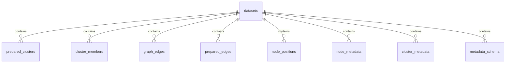

# Data model and persistence

PhyloLens uses separate models for normalized input, prepared layout artifacts,
and HTTP responses. This separation prevents source-format concerns from leaking
into layout and rendering code.

```text
raw Newick / typing profiles / metadata
  → Dataset
  → PreparedLayoutArtifacts
  → persisted layout version
  → viewport, region, and search responses
```

## Domain model

The immutable domain model is defined in `domain/models.py` and is the only graph shape
accepted by the preparation pipeline.

### `Dataset`

| Field | Type | Meaning |
| --- | --- | --- |
| `dataset_id` | `str` | Caller-supplied dataset name and namespace |
| `nodes` | `tuple[GraphNode, ...]` | Graph nodes |
| `edges` | `tuple[GraphEdge, ...]` | Graph edges |
| `technical_roots` | `tuple[str, ...]` | One orientation root per tree component; no founder meaning |
| `ancillary_schema` | `tuple[AncillaryField, ...]` | Public scalar ancillary fields |
| `summary_schema` | `tuple[AncillaryField, ...]` | Computed biological summary fields |
| `annotations_by_node_id` | Read-only mapping to `NodeAnnotations` | Direct observations and typed summaries |
| `ancillary_rows_by_node_id` | Read-only mapping to tuples of ancillary values | Original ancillary rows joined to each node |
| `isolates_by_node_id` | Read-only mapping to `tuple[Isolate, ...]` | Original typing IDs and per-isolate metadata for each biological profile; empty for Newick |
| `source` | `DatasetSource` | Source format, generation timestamp, rooting strategy, and optional provenance |

### `GraphNode`

| Field | Type | Meaning |
| --- | --- | --- |
| `id` | non-empty `str` | Stable graph identifier |
| `x`, `y` | `float | None` | Optional source-provided coordinates |
| `cluster_id` | `str | None` | Optional topology hint |
| `is_cluster_proxy` | `bool | None` | Optional source hint |
| `is_cluster_skeleton` | `bool | None` | Optional source hint |
| `subtree_size` | positive `int | None` | Optional structural metric |
| `leaf_count` | positive `int | None` | Optional structural metric |

Newick and typing-data normalization currently produce topology and identifiers;
coordinates are normally assigned later by the layout pipeline.

### `GraphEdge`

| Field | Type | Meaning |
| --- | --- | --- |
| `id` | non-empty `str` | Deterministic edge identifier |
| `source` | non-empty `str` | Source node identifier |
| `target` | non-empty `str` | Target node identifier |
| `distance` | non-negative `float | None` | Branch or allelic distance |

Every edge entering preparation must reference existing nodes. Supplied
distances must be finite and non-negative; omitted Newick branch lengths remain
`None`, including in partially weighted trees. LoD uses tree hops, not distance.

### Metadata types

`AncillaryField.type` is one of:

```text
string | number | boolean | null
```

Published ancillary schemas exclude internal summary fields. The v1 flat
projection carries represented-isolate and category counts in viewport metadata
and region aggregates; search matching ignores those internal keys.

## Prepared layout model

Preparation converts a dataset into immutable artifacts identified by
`(dataset_id, layout_version)`.

### `PreparedLayoutArtifacts`

| Field | Type | Meaning |
| --- | --- | --- |
| `dataset` | `Dataset` | Normalized graph and metadata |
| `layout_version` | `str` | Deterministic preparation fingerprint |
| `clusters` | `tuple[PreparedCluster, ...]` | Rooted-prefix singletons and pendant subtrees at selected hop depths |

Selected depths approximate geometric growth in visible representation count,
independently of hop-based membership. There is no fixed maximum tier count;
maximum hop depth is always full detail and redundant count-identical preceding
cuts are omitted. Trees/MSTs may be biologically unrooted: technical orientation
does not assert biological ancestry. Supplied branch distances remain part of the dataset.
Viewport reads are unbounded unless an explicit caller supplies `max_nodes`;
spatial bounds and LoD control normal query complexity. During interaction,
semantic zoom supplies a preferred tier and viewport representation counts
select its effective resolution, including earlier refinement in sparse regions. This does not change prepared membership.

### `PreparedCluster`

| Field | Type | Meaning |
| --- | --- | --- |
| `cluster_id` | `str` | Deterministic identifier derived from LoD level and attachment/representative node |
| `lod_level` | `int` | Index of the exposed depth cut |
| `member_node_ids` | `tuple[str, ...]` | Graph member nodes |
| `representative_node_id` | `str` | Member used as the visible representative |

For a collapsed subtree, the representative is its member incident to the
single edge attaching it to the visible tree. Visible nodes represent
themselves. The representative has no biological founder meaning.

### Layout records

`ClusterLayout` stores one representative position and spatial extent for a
cluster:

- `x`, `y`;
- `radius`;
- `bounds`;
- `member_count`;
- `status`.

`NodeLayoutPosition` stores the finest-detail coordinates of one graph node.
`QuotientEdge` stores one quotient edge for one LoD level.

### Layout status

```text
pending | refining | ready | degraded | failed
```

Current preparation publishes `ready` only. `degraded` is retained for layouts
created by earlier service versions and is not produced as a Graphviz fallback.
`pending` and `refining` describe in-flight work. `failed` is a terminal job
state and is not published as a readable layout version.

Domain graph values live in `domain/models.py`, prepared values in
`domain/preparation.py`, and query/view values in `domain/views.py` and
`domain/search.py`. HTTP response DTOs remain in `http/graph/schemas.py`.

## Read models

Repository readers return server-internal result objects before HTTP mapping.

### `ViewportNode`

| Field | Meaning |
| --- | --- |
| `node_id` | Visible node or representative identifier |
| `cluster_id` | Cluster represented by the node; finest-detail nodes retain their cluster association |
| `x`, `y` | Global prepared-layout coordinates |
| `layout_status` | Status of the published layout |
| `member_count` | Number of graph nodes represented; `1` at finest detail |
| `is_representative` | Whether the node is a cluster representative, including coarse-tier singletons |
| `metadata` | Node or cluster metadata visible to the caller |

### `ViewportEdge`

Ordinary edges preserve original endpoints and distance. Meta-edges produced by
cluster expansion additionally expose `is_meta = true` and represent a single
external tree edge.

### `ViewportReadResult`

A viewport result includes:

- visible nodes and edges;
- `total_node_count` before the response budget is applied;
- `truncated`;
- `layout_status`;
- global layout bounds;
- public metadata schema.

### `RegionReadResult`

Region reads return finest-detail nodes within a rectangular selection and add
`aggregated_metadata`:

- numeric fields: arithmetic mean of non-null values;
- categorical and boolean fields: mode, with deterministic tie-breaking.

### Search results

`SearchMatch` contains the graph node identifier, score, matched text,
cluster association and global position when available. Search does
not return generated union identifiers as user-facing matches.

## Layout identity

`layout_version` is a SHA-256-derived fingerprint of all persisted preparation
inputs and `LAYOUT_PIPELINE_VERSION`.

The fingerprint includes:

- dataset identifier;
- sorted node and edge records;
- distances;
- explicit `technical_roots` and the source `rooting_strategy`;
- the representation-growth selection policy version and growth factor;
- public metadata schema;
- node metadata;
- ancillary rows;
- source format and stable provenance fields.

The generated timestamp is excluded. JSON keys and collections are ordered
canonically, so Python dictionary insertion order does not affect identity.
Metadata changes supplied to preparation therefore invalidate reuse even when
topology remains the same. Changing the resolved technical root changes
`layout_version` even if topology is unchanged.

Post-load ancillary replacement takes a separate path: it derives a new version
from a namespaced hash of the source version, dataset identifier, replacement
schema, and normalized node metadata. Within one transaction it copies the
geometry tables and writes replacement metadata and cluster summaries. The source
version remains immutable; no layout or cluster construction runs. Existing
read APIs and schema tables require no migration. This trades additional storage
and database copying for a small change to the existing version model.

## Persistence model

PhyloLens provides the same logical artifact model through SQLite and
PostgreSQL.

- **SQLite** supports the in-process service mode.
- **PostgreSQL** supports durable job coordination and multiple API/worker
  processes.

All artifact tables are keyed by `(dataset_id, layout_version)`.


```mermaid
erDiagram
  datasets ||--o{ prepared_clusters : contains
  datasets ||--o{ cluster_members : contains
  datasets ||--o{ graph_edges : contains
  datasets ||--o{ prepared_edges : contains
  datasets ||--o{ node_positions : contains
  datasets ||--o{ node_metadata : contains
  datasets ||--o{ cluster_metadata : contains
  datasets ||--o{ metadata_schema : contains
```

| Table | Purpose |
| --- | --- |
| `datasets` | Publication status and timestamps for each layout version |
| `prepared_clusters` | Cluster membership summary, representative, position, radius, and bounds per hop-depth cut |
| `cluster_members` | Cluster-to-node membership |
| `graph_edges` | Original graph edges |
| `prepared_edges` | Quotient edges per LoD level |
| `node_positions` | Finest-detail global node coordinates |
| `node_metadata` | Public node metadata encoded as JSON |
| `cluster_metadata` | Aggregated public cluster metadata encoded as JSON |
| `metadata_schema` | Field key and ancillary scalar type |

PostgreSQL additionally stores durable prepare jobs and lease state in
`prepare_jobs`.

## Publication semantics

The preparation service stages and publishes a layout in ordered repository
operations, each owning its transaction:

1. clear existing artifacts for the same identity;
2. create the dataset row with status `refining`;
3. persist topology, membership and annotations;
4. persist node and cluster layouts;
5. persist prepared quotient edges;
6. change the dataset status to `ready` or `degraded`.

Reads that omit `layout_version` resolve only the latest published version. A
partially written `refining` version cannot replace an earlier readable layout
when resolving the latest version. Explicit supplied-version reads retain their
existing behavior. Ancillary revision copying/publication is one transaction;
preparation as a whole is not.

## Query indexes

The schema uses ordinary database indexes rather than a separate spatial-index
service. Important access patterns include:

- cluster-bounds overlap at a selected LoD level;
- finest-detail node position bounds;
- prepared-edge lookup by visible representatives;
- original-edge lookup by node endpoints;
- metadata and cluster-membership lookup by layout identity.

The concrete SQLite and PostgreSQL schemas are maintained under
`code/server/sql/`.

## Contract boundaries

The domain and prepared models are internal Python contracts. Browser
applications should depend only on:

- the package-root TypeScript API;
- the versioned HTTP schemas documented in [API reference](./API_REFERENCE.md).

Database tables and internal dataclasses are not public compatibility contracts.

## Profile membership persistence

The additive `profile_isolates` table stores `(dataset_id, layout_version, node_id,
isolate_id, metadata_json)` in SQLite and PostgreSQL. An isolate ID is unique
within one dataset version. Membership and original metadata participate in the
layout fingerprint, so old ungrouped layouts are not reused as grouped layouts.
Dataset/version cleanup removes membership records with the other layout data.

SQLite initializes the additive table when opening a store. Existing PostgreSQL
deployments must rerun the documented schema initialization before using the new
service; `create table if not exists` preserves existing data. Legacy datasets
have no isolate records until re-prepared from their typing input.

Finest-detail viewport and region nodes expose `isolates`, each containing `id`
and `metadata`. LoD representatives covering multiple profiles omit the individual
records (an empty list) while carrying summed profile/category counts. Their
`member_count` continues to count graph nodes, not isolates.
Original-ID search returns the containing profile's ID and global coordinates.
