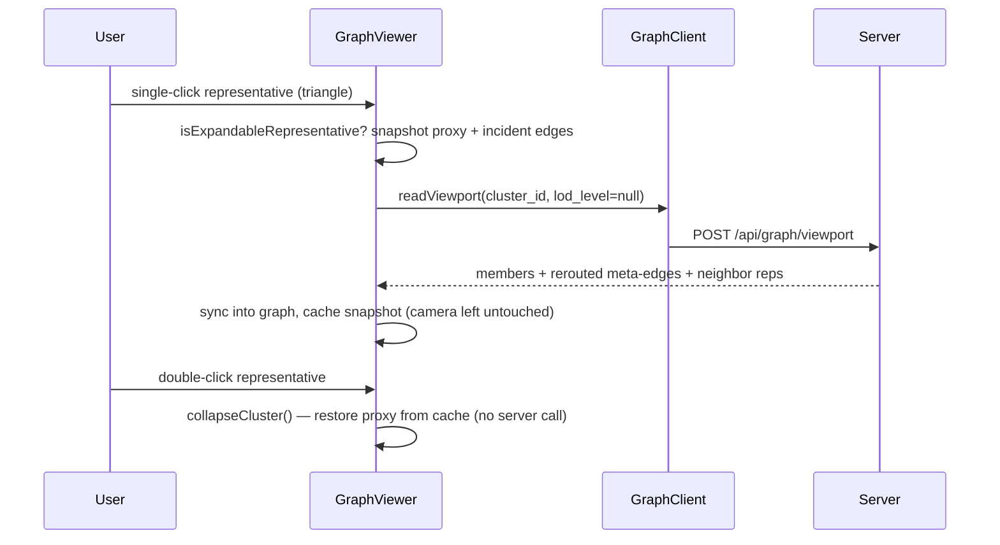

# Cluster Expand / Collapse

Interactive expand and collapse of distance-based clusters, faithful to PHYLOViZ
clade navigation and to branch-length correctness. This describes **shipped**
behavior (Phase 1). It borrows the meta-edge model from the
`cytoscape.js-expand-collapse` extension, adapted to PhyloLens' server-side,
threshold-driven architecture.

See [`LOD_AND_CLUSTERING.md`](./LOD_AND_CLUSTERING.md) for how clusters and
representatives are built, and [`CLIENT_RENDERING.md`](./CLIENT_RENDERING.md) for
the triangle rule and rendering.

## Goals

1. Let a user expand a clade into its members and collapse it back as an
   explicit interaction — a **single click** expands a representative, a
   **double-click** collapses it — independent of zooming.
2. Keep a collapsed clade **visibly connected** to the rest of the tree by
   rerouting its boundary edges to the neighboring representatives (meta-edges).
   A collapsed clade that dropped its external connections would be misleading.
3. Preserve branch-length fidelity: meta-edge distances stay server-computed.
4. Add no server round-trip when collapsing an already-expanded cluster.

## Interaction

## Server: Meta-Edge Rerouting

When a viewport read carries a `cluster_id`, `read_viewport` expands that
cluster into its member nodes (ignoring bounds, so the whole cluster returns) and
calls `_read_expansion_meta_edges` (`store.py`). Member internal edges come back
directly; the members' edges to the rest of the tree would otherwise reference
off-slice nodes, so they are **rerouted**:

1. Look up the expanded cluster's `threshold`.
2. Read every `graph_edges` row touching a member node, then keep only genuine
   **boundary edges** (exactly one endpoint inside the cluster).
3. Resolve each outside endpoint to the representative of the cluster it belongs
   to **at the same threshold** (`_representatives_for_nodes`) — the nearest
   visible representative. This is a precomputed partition lookup, not a runtime
   tree walk, so it is order-independent by construction.
4. **Bundle** boundary edges by `(inside member, neighbor representative)`,
   keeping the **minimum** boundary distance, and set `bundled_edge_count`.
5. Emit each bundle as a `ViewportEdge` with `is_meta = true`, and surface the
   distinct neighbor representatives as nodes so every meta-edge references a
   returned node.

The minimum distance is read phylogenetically as "closest approach into the
clade" — how related the outside taxon is to the collapsed group.

`GraphViewportEdge` carries the optional `is_meta` and `bundled_edge_count`
fields; ordinary edges leave them `None`.

## Client: Stateful Collapse (`GraphViewer.ts`)

The client keeps the expansion reversible without a server round-trip:

- **`expandClusterFromClick`** — on single-click of an expandable representative
  (`isExpandableRepresentative`), it **snapshots the proxy** first
  (`captureClusterSnapshot`: the representative node's attributes plus its
  incident edges, shallow-copied since Graphology returns live references), then
  queries `cluster_id` with `lod_level = null`, syncs the members in, records the
  returned member IDs, and stores the snapshot in `expandedClusterCache` keyed by
  cluster ID. The members are added **in place** — the camera is left untouched
  so the surrounding graph stays visible and the user can keep expanding
  additional clusters up to the node budget without the view snapping to a single
  expanded region.
- **`collapseClusterFromDoubleClick` → `collapseCluster`** — on double-click, it
  drops the cached member nodes, re-adds the representative node from the
  snapshot, and restores the snapshot's incident edges — **no server call**. It
  clears the cache entry and the `expandedClusterIds` membership.

`SigmaViewportLike` models both `clickNode` and `doubleClickNode` so the two
gestures are distinct.

## Correctness Invariants

- Every returned edge, including meta-edges, references a returned visible node
  (members, the expanded representative, or a surfaced neighbor representative).
- One meta-edge per `(inside member, neighbor representative)` pair after
  bundling; `bundled_edge_count` records how many boundary edges folded in.
- Meta-edge distance is the server-computed minimum boundary distance; the client
  never fabricates a distance.
- Expand then collapse returns the proxy to its prior attributes and incident
  edges from cache.
- Aggregation rules (mode categorical/boolean, mean numeric) and internal-key
  filtering (`profile_count`, `__category_count__*`) are unchanged.

## Later Phases (not yet shipped)

- **Meta-edge bundling styling** — thicker/annotated edges driven by
  `bundled_edge_count`.
- **Undo/redo history** — capture pre-expand positions and restore them verbatim
  on collapse (pixel-identical return), following the Cytoscape
  `undoRedoUtilities` pattern.
