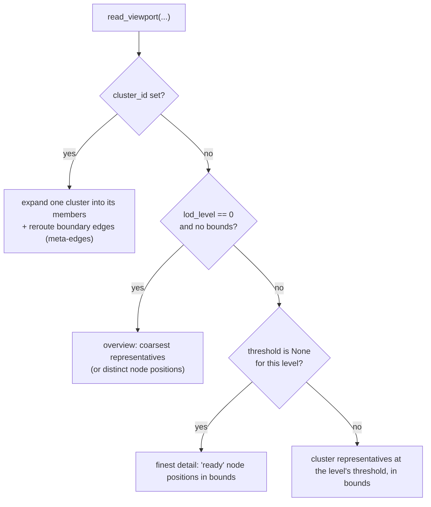

# Level of Detail and Clustering

PhyloLens renders large trees with a **semantic zoom** model: the server exposes
several precomputed *level-of-detail (LoD) tiers*, and the client requests
whichever tier matches the current camera zoom. Zooming out shows fewer,
coarser cluster representatives; zooming in reveals finer structure and
eventually individual nodes. This document explains how tiers are built
(server) and how zoom maps to a tier (client).

There is no spatial R-tree. Bounds queries are served by ordinary SQLite indexes
on the coordinate columns (see [`DATA_MODEL.md`](./DATA_MODEL.md)).

## Tiers Are Distance Thresholds

Clustering is single-linkage by branch-length distance. For a threshold `t`, two
nodes are in the same cluster if they are connected by a path of edges each with
`distance <= t`. Computed with Union-Find (`_UnionFind` in `ingest.py`, path
compression + union by size), this is order-independent, so the partition at any
threshold is deterministic.

Each **selected threshold is one LoD tier.** A large threshold merges most of the
tree into a few big clusters (overview); a small threshold leaves many small
clusters (detail).

## Selecting Thresholds (`selected_distance_thresholds`)

Up to `MAX_CLUSTER_THRESHOLDS = 16` thresholds are chosen so tiers are spaced
usefully rather than arbitrarily:

1. Take the unique edge distances, sorted descending.
2. Compute the connected-component count at each distance
   (`threshold_component_counts`).
3. Ask `representative_targets(node_count, 16)` for anchor cluster counts
   (coarse→fine): an **overview** count, a geometric-mean **medium** count, and
   the **full** node count. Placing medium at the geometric mean of overview and
   `node_count` splits the overview→detail jump evenly on a log scale, so one
   zoom step never dumps the whole tree.
   - Overview ≈ `sqrt(node_count) * SMALL_GRAPH_OVERVIEW_FACTOR`, clamped between
     `MIN_OVERVIEW_REPRESENTATIVES` and `MAX_OVERVIEW_REPRESENTATIVES` for large
     graphs.
4. For each target count, pick the threshold whose component count best matches
   (`threshold_for_representative_target`).
5. Always include the finest threshold (the maximum distance).
6. De-duplicate and return up to 16 thresholds, descending.

`lod_tier_count` in `GraphV2PrepareResponse` is the count of distinct non-None
thresholds actually produced — the number of tiers the client may zoom across.

## Representatives

Each cluster names one `representative_node_id`, chosen by
`representative_by_centroid`. This is a **layout-centroid heuristic, not a
distance medoid**: once members are positioned it picks the member closest to
the cluster's spatial centroid (tie-broken by higher internal degree, then id)
so the proxy sits visually in the middle of its cluster; before positions exist
it falls back to the most internally connected member. It does not minimize
summed genetic distance. The representative stands in for its cluster at coarser
tiers and becomes the click target for expansion (see
[`EXPAND_COLLAPSE.md`](./EXPAND_COLLAPSE.md)).

## `lod_level` ↔ threshold

`lod_level` is the wire representation of a tier: a **0-based index into the
distinct thresholds ordered coarse→fine (descending distance).**

`_threshold_for_lod_level` (`store.py`) is the single source of truth:

```python
# distinct non-NULL thresholds, ORDER BY threshold DESC   (coarse -> fine)
index = min(max(lod_level, 0), len(rows) - 1)             # clamp into range
threshold = rows[index]["threshold"]
return None if threshold == min_threshold else threshold  # finest -> node positions
```

So `lod_level = 0` is the coarsest tier; the highest index is finest. When the
requested level lands on the minimum threshold, it returns `None` — meaning
"render individual node positions", not representatives. This function has **no
short-circuit** for `lod_level >= 1`: every level indexes into the real
thresholds, which is what makes intermediate tiers work.

## Server Viewport Reads (`read_viewport`)

`read_viewport` chooses one of four mutually exclusive paths:



Bounds filtering applies to the representative and ready-node paths; the
`cluster_id` expansion path intentionally ignores bounds so an opened cluster
always returns all its members. Every path is capped at `max_nodes`; the result
carries `total_node_count` and `truncated`.

## Client: Mapping Zoom to a Tier (`graphViewerV2Query.ts`)

The client turns Sigma's camera `ratio` (smaller ratio = zoomed in) into a tier
index using **geometric bands**. Boundary for tier `k`:

```
B_k = GRAPH_VIEWER_V2_DETAIL_RATIO_THRESHOLD * GRAPH_VIEWER_V2_LOD_RATIO_STEP^(k-1)
    = 0.8 * 0.4^(k-1)
```

`semanticLodLevelForCameraRatio(ratio, lodTierCount)`:

- `ratio >= 0.8` → tier `0` (overview).
- otherwise walk boundaries `0.8 * 0.4^k` downward, incrementing the tier each
  time `ratio` is still below the boundary, clamped to `lodTierCount - 1`.

So each finer tier needs ~2.5× more zoom-in than the previous one. Example with
3 tiers: `ratio >= 0.8` → 0; `0.32 <= ratio < 0.8` → 1; `ratio < 0.32` → 2.

### Hysteresis (anti-oscillation)

`semanticLodLevelForCameraRatioWithHysteresis(ratio, lodTierCount, currentLodLevel)`
wraps the band mapping with a symmetric dead-band of
`GRAPH_VIEWER_V2_LOD_RATIO_HYSTERESIS = 0.05` around the boundary being crossed.
While the camera ratio sits inside `[boundary - 0.05, boundary + 0.05]`, the
current tier is held instead of flipping. This stops small zoom wobble near a
boundary from thrashing back and forth between two server queries.

`GraphViewerV2` passes the last requested tier as `currentLodLevel`, so the
dead-band is always anchored on the tier currently on screen. A LoD-tier change
refreshes after `GRAPH_VIEWER_V2_LOD_CHANGE_DEBOUNCE_MS = 60ms`; same-tier pans
after `DEFAULT_GRAPH_VIEWER_V2_DEBOUNCE_MS = 120ms`.

### Pan-Driven Exploration

Same-tier pan behavior depends on the tier:

- **Tier 0** carries no bounds — it is a fixed global overview, so a same-tier
  pan would refetch the identical slice and is skipped.
- **Tiers > 0** are bounds-driven, so a same-tier pan shifts the visible region
  and schedules a debounced, bounded refetch that reveals the nodes the camera
  moved onto. No refetch moves the camera, so exploration stays smooth, and the
  debounce collapses a burst of pan events into a single query.

Trees at or below `GRAPH_VIEWER_V2_SMALL_TREE_NODE_THRESHOLD = 2500` nodes are
drawn once at tier 0 and never re-queried on camera movement (LoD-crossing zooms
still transition). This threshold sits deliberately below the
`DEFAULT_GRAPH_VIEWER_V2_MAX_NODES = 5000` per-query node cap, so mid-size trees
between the two values still use bounded pan-refetch instead of freezing on the
overview.

## Complexity

Tier construction is prepare-time: Union-Find is near-linear in edges per
threshold, over up to 16 thresholds. Viewport reads are index-bounded SQLite
queries whose cost tracks the returned slice size (≤ `max_nodes`) rather than the
total node count. Benchmark the whole `read_viewport` call, not just the index
lookup, since metadata attachment and edge assembly are part of the cost.
