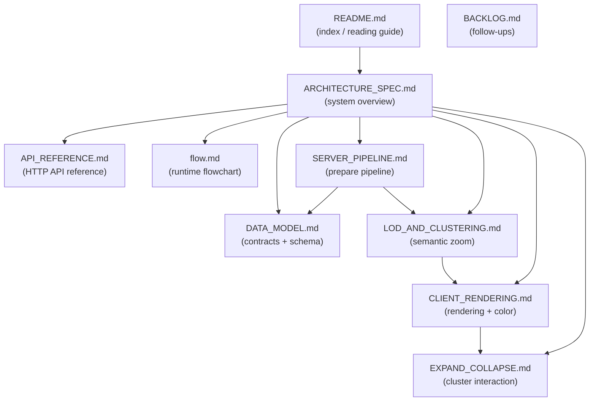

# PhyloLens Documentation

PhyloLens is a next-generation phylogenetic visualization tool. It re-imagines
the PHYLOViZ desktop experience as a **server-precomputed, semantic-zoom**
web application: the server owns phylogenetic semantics and level-of-detail
(LoD) precomputation, while a Sigma.js client owns interaction, camera state,
and rendering.

The core idea is a map-style model. A dataset is prepared once — parsed,
normalized, clustered into a threshold hierarchy, and laid out with a
force-directed algorithm. At interaction time the client asks the server only
for the slice of the graph visible in the current viewport at the current zoom
tier. The browser never holds the full topology of a large tree.

## Reading Guide

Start here, then follow the path that matches your interest.

| If you want to understand… | Read |
| --- | --- |
| The whole system at a glance | [`ARCHITECTURE_SPEC.md`](./ARCHITECTURE_SPEC.md) |
| The HTTP API field-by-field (routes, models, errors) | [`API_REFERENCE.md`](./API_REFERENCE.md) |
| The runtime flow end to end | [`flow.md`](./flow.md) |
| The data contracts and storage schema | [`DATA_MODEL.md`](./DATA_MODEL.md) |
| How a dataset becomes a laid-out artifact | [`SERVER_PIPELINE.md`](./SERVER_PIPELINE.md) |
| How zoom maps to detail (the LoD engine) | [`LOD_AND_CLUSTERING.md`](./LOD_AND_CLUSTERING.md) |
| How the client draws and colors the graph | [`CLIENT_RENDERING.md`](./CLIENT_RENDERING.md) |
| How clusters expand and collapse | [`EXPAND_COLLAPSE.md`](./EXPAND_COLLAPSE.md) |
| Deferred tuning / scalability follow-ups | [`BACKLOG.md`](./BACKLOG.md) |

## Document Map

## System Summary

- **A small set of HTTP routes drive everything.** The core loop is
  `POST /api/graph/prepare` (materialize layout artifacts) and
  `POST /api/graph/viewport` (read a bounded slice);
  `POST /api/graph/region` serves an on-demand box-select read with
  aggregated metadata. See [`ARCHITECTURE_SPEC.md`](./ARCHITECTURE_SPEC.md) for
  the system map, or [`API_REFERENCE.md`](./API_REFERENCE.md) for the
  field-level route/model/error reference.
- **Prepared layout lives in SQLite.** The server materializes clusters,
  per-tier edges, node positions, and metadata into a nine-table store keyed by
  `(dataset_id, layout_version)`. See [`DATA_MODEL.md`](./DATA_MODEL.md).
- **Clustering is threshold-based.** Weighted edges feed Union-Find at up to 16
  distance thresholds. Each threshold is one LoD tier; each tier's
  representatives (the member nearest the cluster's layout centroid) stand in for
  their members at coarser zoom. See
  [`LOD_AND_CLUSTERING.md`](./LOD_AND_CLUSTERING.md).
- **Layout is force-directed (Graphviz `sfdp`)**, computed once during prepare,
  with node-count-aware iteration and timeout budgets and a graceful degrade
  path. See [`SERVER_PIPELINE.md`](./SERVER_PIPELINE.md).
- **The client maps camera zoom to a tier** using geometric ratio bands with a
  hysteresis dead-band, then requests that tier's slice. Nodes are colored by
  their PHYLOViZ role by default, or by a frequency-ranked value color map when a
  visual mapping is active (shared by node fills, pies, and the ancillary wheel);
  multi-member clusters render as triangles. See
  [`CLIENT_RENDERING.md`](./CLIENT_RENDERING.md).
- **Clusters expand and collapse interactively.** Expanding a representative
  reroutes its boundary edges to neighboring representatives as bundled
  min-distance meta-edges; collapse restores the proxy from a client-side cache
  with no server round-trip. See [`EXPAND_COLLAPSE.md`](./EXPAND_COLLAPSE.md).

## Conventions Used in These Docs

- **Mermaid diagrams** are embedded directly in Markdown so they render on
  GitHub and in most Markdown viewers.
- **Code citations** name the file and the function/class so claims can be
  checked against source. Field names, constants, and formulas are quoted
  verbatim from the code.
- **"LoD tier" and "lod_level"** refer to the same concept from two sides: a
  tier is a distinct distance threshold; `lod_level` is its 0-based index into
  the thresholds ordered coarse→fine.
