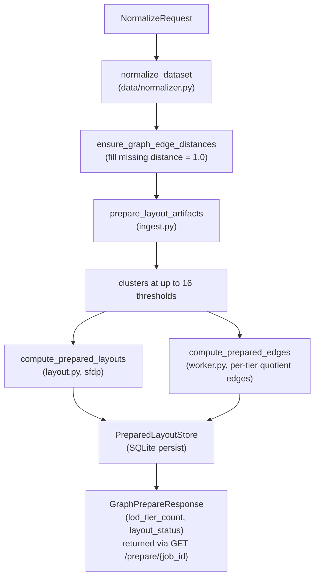
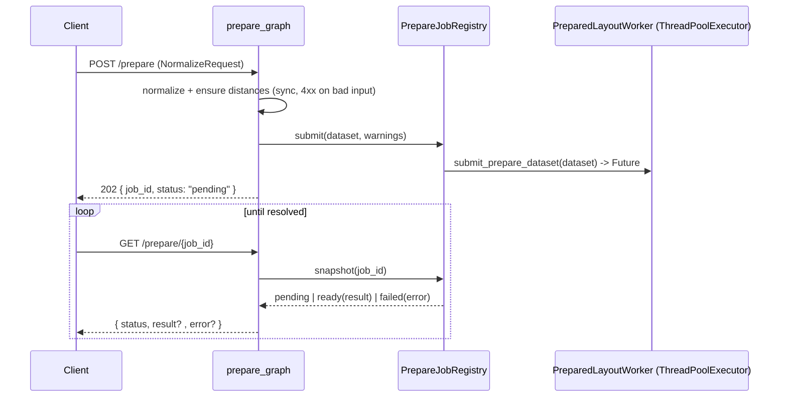

# Server Prepare Pipeline

`POST /api/graph/prepare` turns raw input into a fully materialized,
queryable layout. This is the only expensive server operation; everything at
interaction time is a bounded read (see
[`LOD_AND_CLUSTERING.md`](./LOD_AND_CLUSTERING.md)). The orchestration lives in
`PreparedLayoutWorker.prepare_dataset` (`prepared_layout/worker.py`), driven by
`prepare_graph` (`api/graph.py`).

Because the force-directed layout can run for a long time on large trees, prepare
is **asynchronous**: `POST /prepare` validates input synchronously, submits the
layout to a background worker, and returns `202 Accepted` with a `job_id`. The
client polls `GET /prepare/{job_id}` until the job resolves. See
[Async Job Flow](#async-job-flow) below.

## Pipeline Overview



Steps 2–5 run on a background worker; the diagram shows the full layout the poll
returns once ready (see [Async Job Flow](#async-job-flow)).

## Step 1 — Normalize

`normalize_dataset(request, expose_internal_schema=True)` parses the source
(Newick via `parse_newick`, which assigns deterministic node IDs of the form
`{prefix}_{index}` and de-duplicates labels) and produces a `CanonicalDataset`
with aligned per-node metadata and a metadata schema. `parse_newick` reads
branch lengths as edge distances.

`ensure_graph_edge_distances` guarantees every edge carries a distance:
missing values default to `1.0` and add a warning. Threshold clustering requires
weighted edges, so this keeps unweighted inputs usable.

## Step 2 — Ingest and Cluster (`ingest.py`)

`prepare_layout_artifacts(dataset, max_thresholds=MAX_CLUSTER_THRESHOLDS)` builds
the cluster hierarchy:

1. Sort nodes by ID for determinism.
2. Select up to `MAX_CLUSTER_THRESHOLDS = 16` distance thresholds via
   `selected_distance_thresholds` (details in
   [`LOD_AND_CLUSTERING.md`](./LOD_AND_CLUSTERING.md)).
3. Build clusters at each threshold via `distance_clusters`, which runs
   Union-Find over edges sorted by distance and forms one `PreparedCluster` per
   multi-node connected component (singletons are not clustered).
4. Each cluster records a `representative_node_id` (via
   `representative_by_centroid` — the member nearest the cluster's layout
   centroid, not a distance medoid) and its `internal_edge_ids` /
   `boundary_edge_ids`.

The result is a `PreparedLayoutArtifacts` (`dataset`, `layout_version`,
`clusters`).

## Step 3 — Global Layout (`layout.py`)

`compute_prepared_layouts` first computes one **global** node layout via
`compute_global_node_positions`, then derives each cluster's representative
position, `radius`, and `bounds` from its members' positions.

### Force-directed layout with Graphviz `sfdp`

`graphviz_sfdp_positions` shells out to the `sfdp` binary (a multilevel
force-directed layout, well suited to large graphs). Edge length passed to
Graphviz is a ratio-preserving multiple of the per-graph **median** distance,
clamped to `[GRAPHVIZ_MIN_EDGE_LENGTH = 0.5, GRAPHVIZ_MAX_EDGE_LENGTH = 12.0]`
around `GRAPHVIZ_TARGET_EDGE_LENGTH = 2.5`, so long-branch outliers and
zero-distance edges cannot destabilize the layout.

Iteration count scales with node count for convergence quality on large graphs:

```python
sfdp_maxiter(n) = round(n * log2(max(n, 2)))   # uncapped; more iters for big graphs
```

There is **no wall-clock timeout** on the `sfdp` subprocess: prepare runs on a
background worker (see [Async Job Flow](#async-job-flow)), so a long layout no
longer risks a dropped HTTP connection, and letting `sfdp` run to completion
avoids discarding a good layout for the circular fallback. Cost is therefore
bounded only by `sfdp_maxiter(n)` and the graph size.

### Graceful degrade

If `sfdp` is missing, fails, or returns incomplete output, layout falls back to a
deterministic circular `jittered_positions` layout and reports
`layout_status = "degraded"` with a specific reason:

| Constant | Meaning |
| --- | --- |
| `LAYOUT_DEGRADED_SFDP_MISSING` | `sfdp` binary not on PATH |
| `LAYOUT_DEGRADED_SFDP_FAILED` | subprocess error |
| `LAYOUT_DEGRADED_SFDP_INCOMPLETE` | fewer positions than nodes |

The reason is threaded through `PreparedLayoutResult.layout_degraded_reason` and
surfaced to the client as a truthful warning by `layout_degraded_warning`.
Trivial graphs (0–1 nodes) skip layout and report `"ready"`.

## Step 4 — Prepared Edges (`compute_prepared_edges`)

For each LoD tier the server precomputes a **quotient edge list**: the original
graph edges collapsed to their representatives at that tier. For each distinct
threshold (enumerated coarse→fine as `lod_level`):

1. Map every member node to its cluster's `representative_node_id`.
2. For each graph edge, map both endpoints to representatives; skip if they
   resolve to the same representative (edge is internal to the cluster).
3. Otherwise emit a `PreparedEdge` keyed by `(lod_level, min_rep, max_rep)`,
   keeping the **minimum-distance** edge when several original edges collapse to
   the same representative pair. The synthetic id is
   `quotient_edge:{lod_level}:{source}:{target}`.

This is what lets a coarse viewport read return representative-to-representative
edges without rewalking the topology.

## Step 5 — Persist and Respond

`PreparedLayoutWorker` clears any prior rows for the dataset, then writes
clusters, cluster members, graph edges, prepared edges, node positions, node and
cluster metadata, and the schema into SQLite (see the schema in
[`DATA_MODEL.md`](./DATA_MODEL.md)). When the poll observes the job as `ready`,
`prepare_response_from_result` computes
`lod_tier_count = max(len(distinct non-None thresholds), 1)` — the same
enumeration `compute_prepared_edges` uses — and builds the
`GraphPrepareResponse` with the counts, `lod_tier_count`, `layout_status`, and
accumulated warnings (submit-time normalize/distance warnings plus any
layout-degrade warning).

## Async Job Flow

The layout above runs off the request thread. The registry and worker lifecycle:



- **Submit (`prepare_graph`).** Normalization and distance validation run
  synchronously so malformed input fails fast with a `4xx`. The dataset plus the
  normalize/distance warnings are handed to `PrepareJobRegistry.submit`, which
  runs `PreparedLayoutWorker.submit_prepare_dataset` on a single-worker
  `ThreadPoolExecutor` and returns a `job_id`. The route responds `202 Accepted`
  with `GraphPrepareJob { job_id, status: "pending", dataset_id }`.
- **Poll (`prepare_graph_status`).** `GET /prepare/{job_id}` reads
  `PrepareJobRegistry.snapshot`, which inspects the `Future`: still running →
  `pending`; raised → `failed` with the error string; done → `ready` with the
  full `GraphPrepareResponse` built by `prepare_response_from_result` (which
  combines the submit-time warnings with any layout-degrade warning). Unknown
  `job_id` → `404`.
- **Registry lifecycle.** `get_prepare_job_registry` is an app-scoped
  `@lru_cache(maxsize=1)` singleton built from the prepared-layout store. The
  FastAPI `lifespan` handler calls `registry.shutdown()` to drain the executor on
  app shutdown.

## Determinism

Every step is deterministic: node/edge sorting, threshold selection, Union-Find
components (order-independent), a fixed `LAYOUT_RANDOM_SEED = 23` for the
fallback, and stable tie-breaks in edge collapse. The same input yields the same
`layout_version` and the same materialized store.
