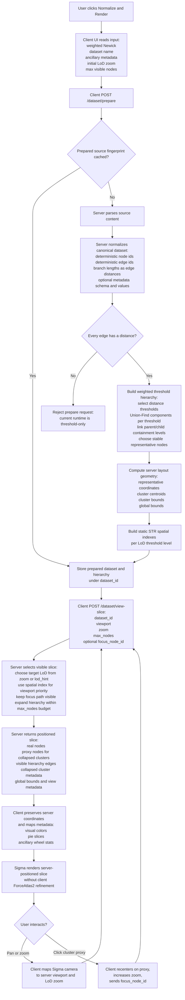

# PhyloLens Runtime Flow

```mermaid
flowchart TD
    A["User clicks Normalize and Render"] --> B["Client UI reads input:
    weighted Newick
    dataset name
    ancillary metadata
    initial LoD zoom
    max visible nodes"]

    B --> C["Client POST /dataset/prepare"]

    C --> C1{"Prepared source fingerprint cached?"}
    C1 -->|Yes| K["Store prepared dataset and hierarchy
    under dataset_id"]
    C1 -->|No| D["Server parses source content"]
    D --> E["Server normalizes canonical dataset:
    deterministic node ids
    deterministic edge ids
    branch lengths as edge distances
    optional metadata schema and values"]

    E --> F{"Every edge has a distance?"}
    F -->|No| G["Reject prepare request:
    current runtime is threshold-only"]

    F -->|Yes| H["Build weighted threshold hierarchy:
    select distance thresholds
    Union-Find components per threshold
    link parent/child containment levels
    choose stable representative nodes"]

    H --> I["Compute server layout geometry:
    representative coordinates
    cluster centroids
    cluster bounds
    global bounds"]

    I --> J["Build static STR spatial indexes
    per LoD threshold level"]

    J --> K["Store prepared dataset and hierarchy
    under dataset_id"]

    K --> L["Client POST /dataset/view-slice:
    dataset_id
    viewport
    zoom
    max_nodes
    optional focus_node_id"]

    L --> M["Server selects visible slice:
    choose target LoD from zoom or lod_hint
    use spatial index for viewport priority
    keep focus path visible
    expand hierarchy within max_nodes budget"]

    M --> N["Server returns positioned slice:
    real nodes
    proxy nodes for collapsed clusters
    visible hierarchy edges
    collapsed cluster metadata
    global bounds and view metadata"]

    N --> O["Client preserves server coordinates
    and maps metadata:
    visual colors
    pie slices
    ancillary wheel stats"]

    O --> P["Sigma renders server-positioned slice
    without client ForceAtlas2 refinement"]

    P --> Q{"User interacts?"}

    Q -->|Pan or zoom| R["Client maps Sigma camera
    to server viewport and LoD zoom"]
    R --> L

    Q -->|Click cluster proxy| S["Client recenters on proxy,
    increases zoom,
    sends focus_node_id"]
    S --> L
```
