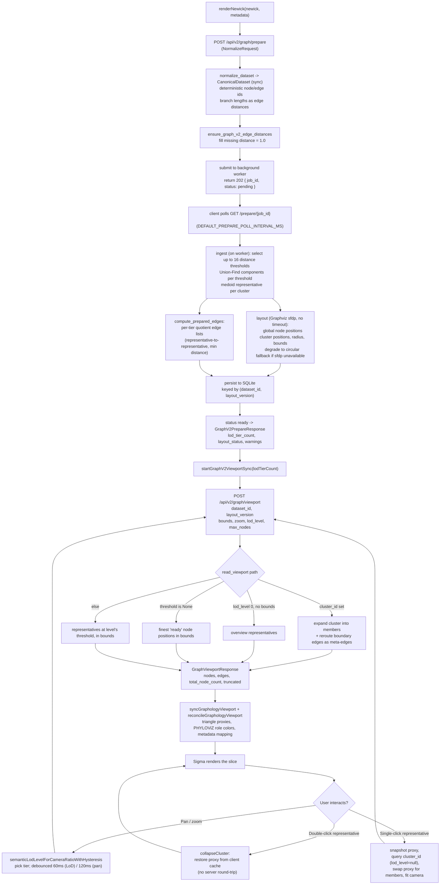

# PhyloLens Runtime Flow

End-to-end runtime for the v2 architecture: one `prepare` (submitted async, then
polled) to materialize the layout, then repeated bounded `viewport` reads driven
by the camera. For the data contracts see [`DATA_MODEL.md`](./DATA_MODEL.md); for
tier selection see [`LOD_AND_CLUSTERING.md`](./LOD_AND_CLUSTERING.md); for the
prepare job flow see [`SERVER_PIPELINE.md`](./SERVER_PIPELINE.md#async-job-flow).

