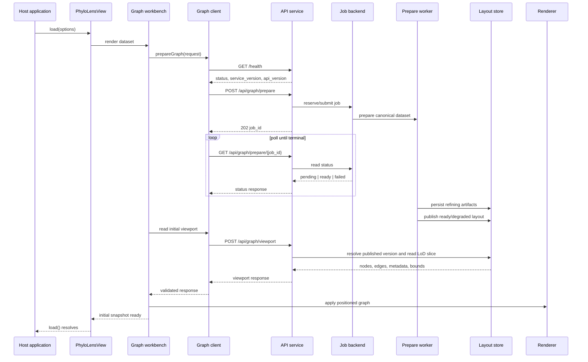
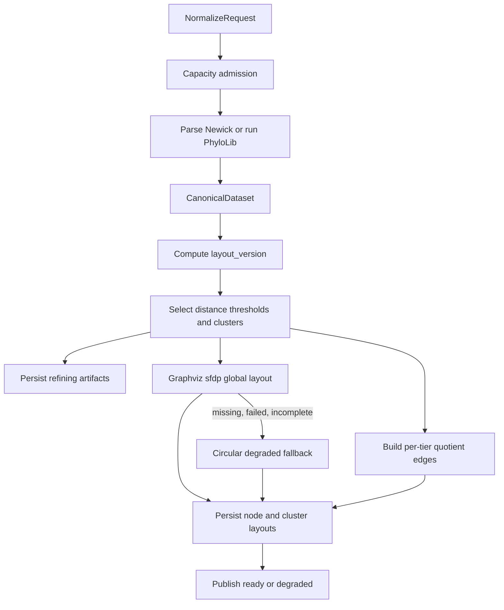
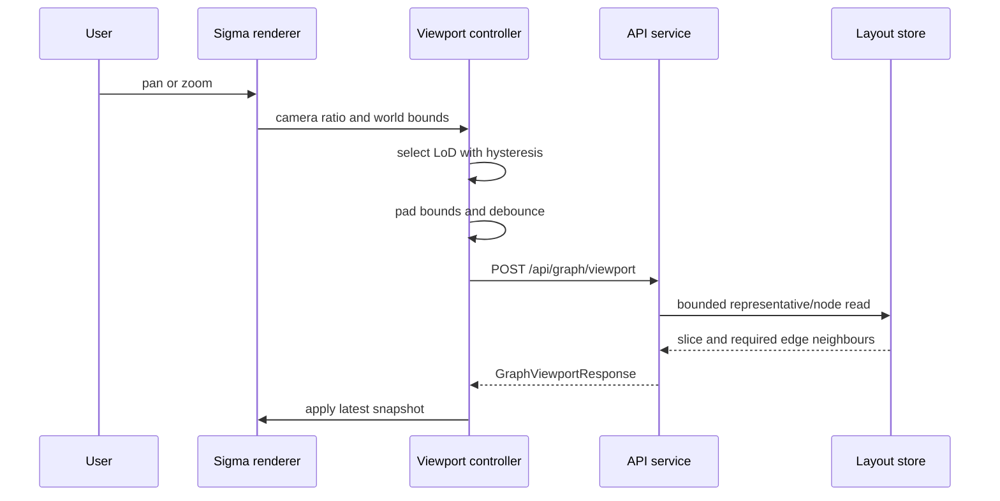
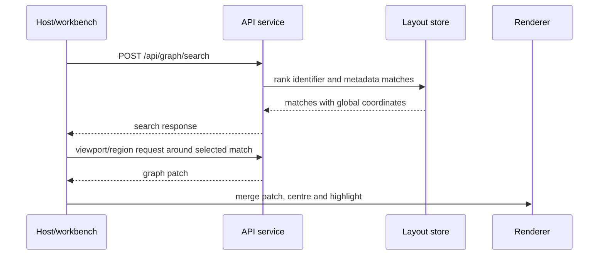
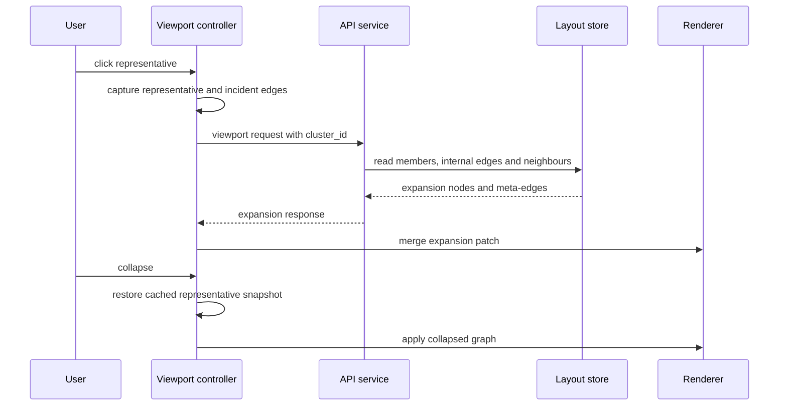

# Runtime flow

This document shows the principal request paths through PhyloLens. It complements
the [architecture](./ARCHITECTURE_SPEC.md), [server pipeline](./SERVER_PIPELINE.md),
and [client rendering](./CLIENT_RENDERING.md) documents.

## Dataset load



## Preparation internals



A Graphviz timeout fails preparation. Missing, failed, or incomplete Graphviz
output uses the documented degraded fallback.

## Camera-driven viewport refresh



Stale responses are discarded through a request sequence. Small graphs loaded at
finest detail do not continuously query the service on camera movement.

## Search and focus



Search is server-side because a matching node may not exist in the current
viewport slice.

## Cluster expansion



Expansion is stateless on the server. Collapse is local and does not issue a
second request.

## Deployment flow

```text
browser
  → same-origin reverse proxy (recommended)
  → PhyloLens API service
  → local registry + SQLite

or

browser
  → API replicas
  → PostgreSQL durable jobs and artifacts
  ← external preparation workers
```

Docker-internal service names are not browser URLs. A host application must use
an externally reachable URL or a reverse-proxy path.
